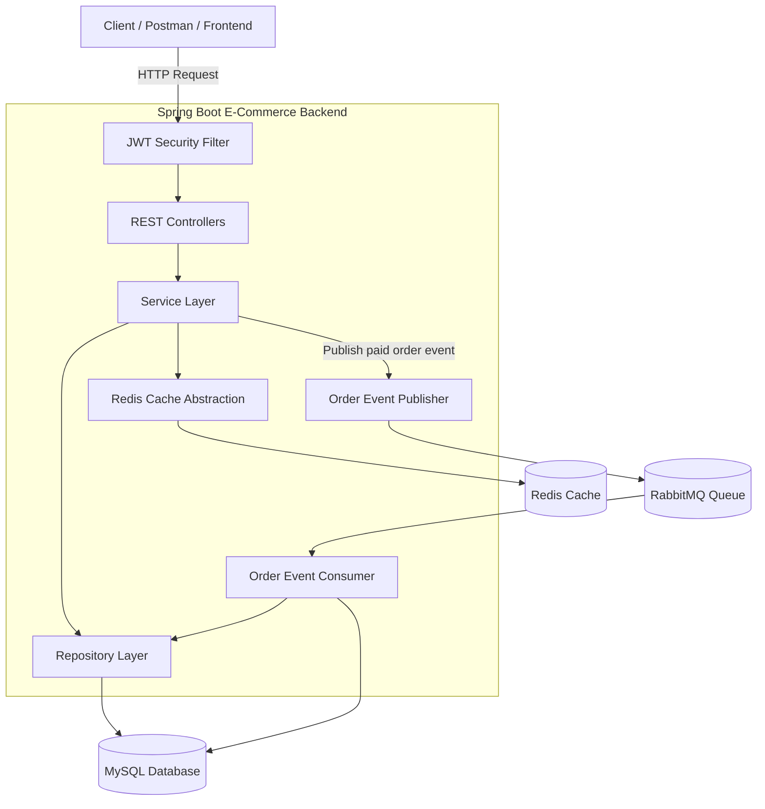
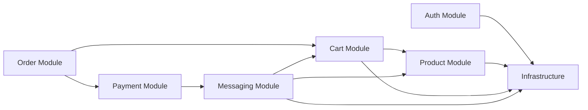
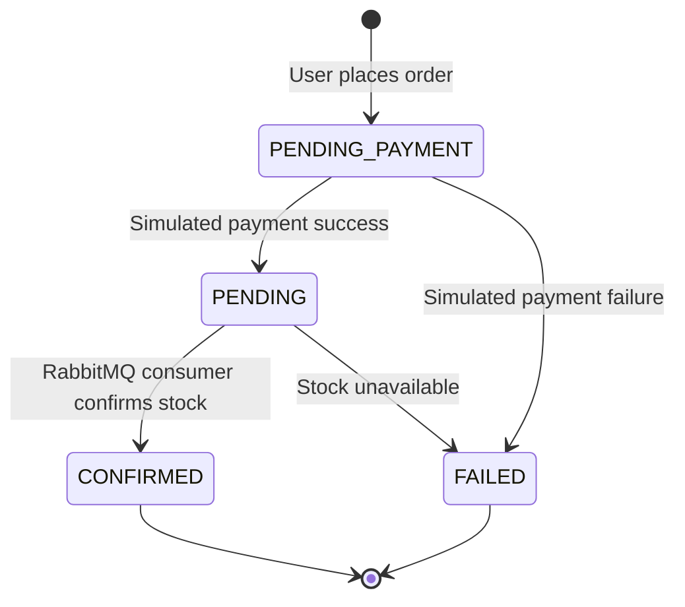
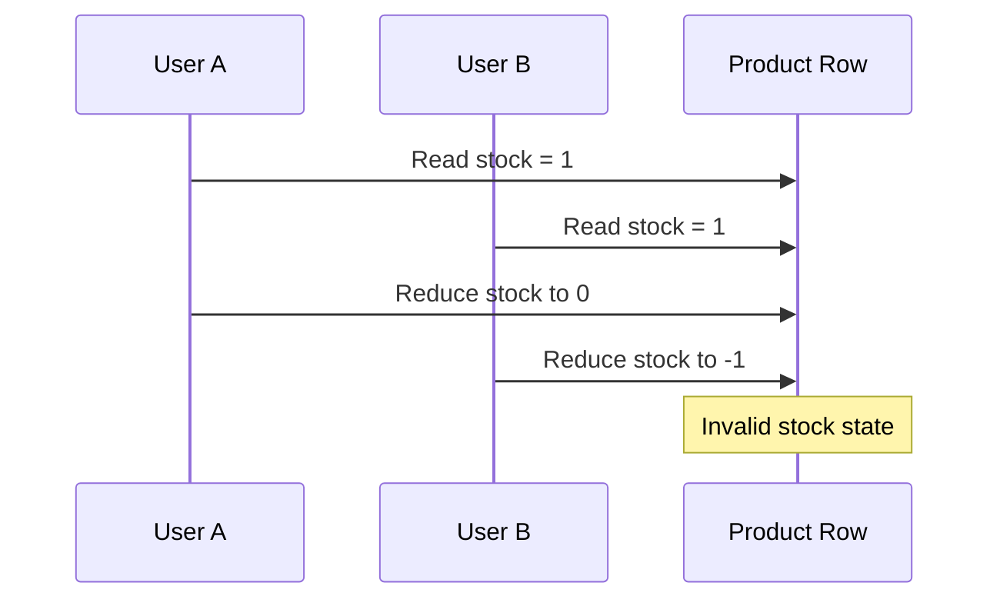
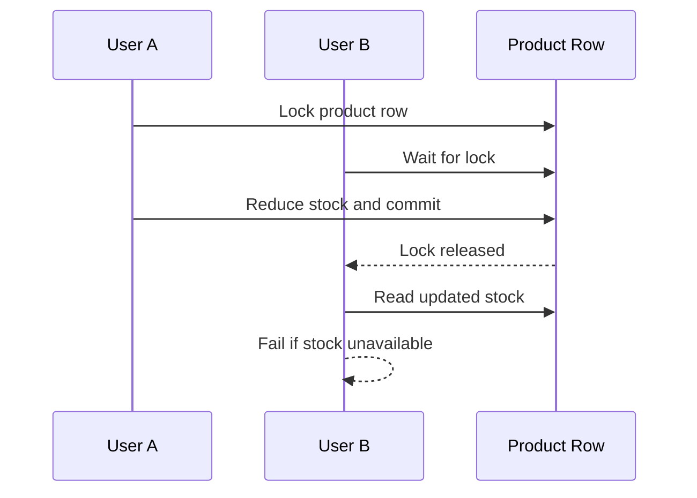
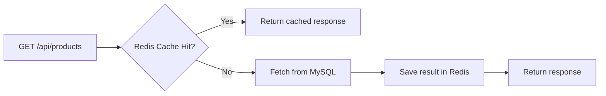
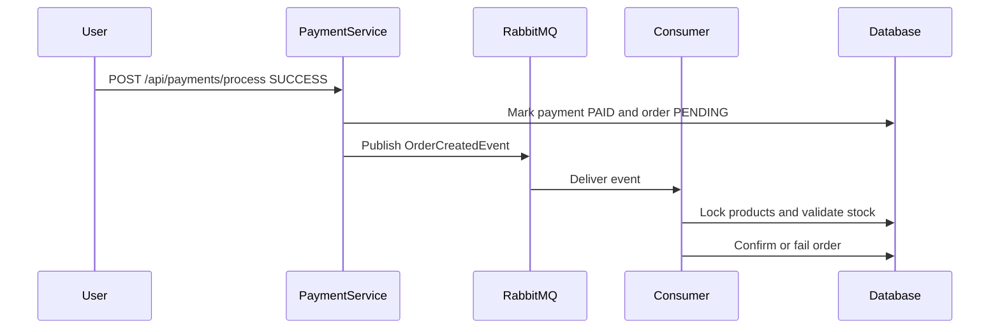
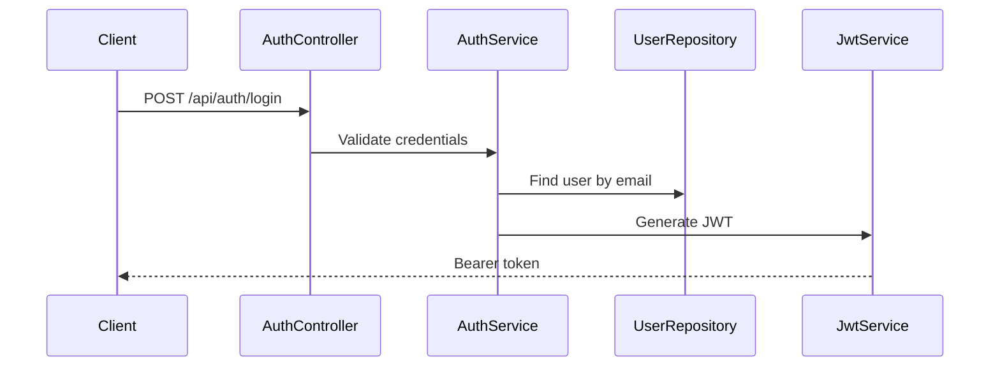
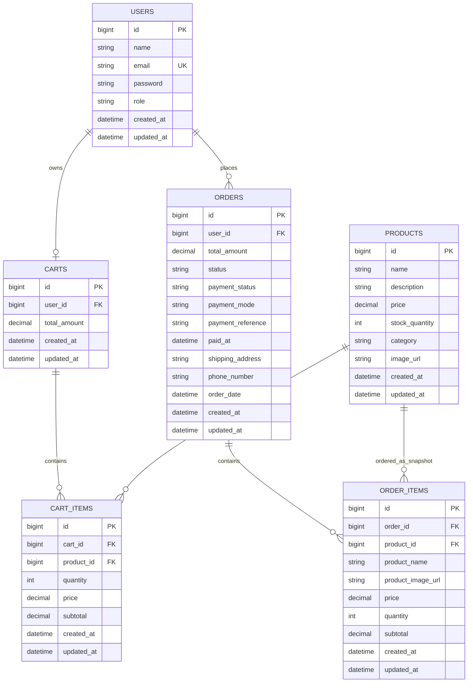

# E-Commerce Platform using Spring Boot

<p align="center">
  <b>Production-style RESTful e-commerce backend built with Spring Boot, JWT security, MySQL, Redis caching, RabbitMQ asynchronous order processing, stock locking, and simulated payment flow.</b>
</p>

<p align="center">
  
  
  
  
  
  
  
</p>

---

## Table of Contents

- [Overview](#overview)
- [Key Capabilities](#key-capabilities)
- [Technology Stack](#technology-stack)
- [System Architecture](#system-architecture)
- [Module Architecture](#module-architecture)
- [Order and Payment Lifecycle](#order-and-payment-lifecycle)
- [Inventory Consistency Strategy](#inventory-consistency-strategy)
- [Redis Caching Strategy](#redis-caching-strategy)
- [RabbitMQ Messaging Strategy](#rabbitmq-messaging-strategy)
- [Security Model](#security-model)
- [Database Design](#database-design)
- [Project Structure](#project-structure)
- [API Reference](#api-reference)
- [Request and Response Samples](#request-and-response-samples)
- [Configuration](#configuration)
- [Local Setup](#local-setup)
- [Running with Docker Services](#running-with-docker-services)
- [Postman Testing Flow](#postman-testing-flow)
- [Build and Verification](#build-and-verification)
- [Git Workflow](#git-workflow)
- [Production Readiness Notes](#production-readiness-notes)
- [Future Enhancements](#future-enhancements)

---

## Overview

This project is a backend-only e-commerce platform developed using Spring Boot. It exposes REST APIs for authentication, product management, cart operations, order placement, simulated payment processing, and asynchronous order confirmation.

Unlike a basic CRUD project, this backend includes several production-style concepts:

- Stateless authentication using JWT.
- Role-based access control for `USER` and `ADMIN`.
- Product catalog APIs with Redis-backed caching.
- Per-user cart management.
- Order creation with payment lifecycle separation.
- Simulated payment gateway flow.
- RabbitMQ-based asynchronous order processing.
- Database pessimistic locking to prevent stock inconsistency.
- Centralized validation and exception handling.
- Layered controller-service-repository architecture.

---

## Key Capabilities

| Capability | Description |
|---|---|
| User Authentication | Register and login users using JWT-based authentication. |
| Role-Based Access | `ADMIN` users can manage products; `USER` users can shop and place orders. |
| Product Catalog | Public product browsing with admin-only create, update, and delete operations. |
| Redis Caching | Product list and product detail APIs are cached for faster reads. |
| Cart Management | Authenticated users can add, update, remove, and clear cart items. |
| Order Placement | Orders are created from the authenticated user's cart. |
| Simulated Payment | Local payment simulation using success/failure payment results. |
| Async Fulfillment | RabbitMQ processes paid orders in the background. |
| Stock Locking | Pessimistic database locks prevent negative stock during concurrent ordering. |
| Error Handling | Centralized JSON error responses using a global exception handler. |

---

## Technology Stack

| Layer | Technology |
|---|---|
| Language | Java 17 |
| Backend Framework | Spring Boot 3.2.5 |
| REST APIs | Spring Web |
| Security | Spring Security, JWT, BCrypt |
| Persistence | Spring Data JPA, Hibernate |
| Database | MySQL |
| Caching | Redis, Spring Cache |
| Messaging | RabbitMQ, Spring AMQP |
| Validation | Jakarta Bean Validation |
| Build Tool | Maven |
| Boilerplate Reduction | Lombok |
| API Testing | Postman |
| Version Control | Git, GitHub |

---

## System Architecture



---

## Module Architecture



### Package Responsibilities

| Package | Responsibility |
|---|---|
| `controller` | Exposes REST API endpoints. |
| `service` | Contains business logic and orchestration. |
| `repository` | Handles database access through Spring Data JPA. |
| `entity` | Defines JPA entities and domain enums. |
| `dto` | Defines request and response payloads. |
| `security` | JWT generation, validation, and authentication filter. |
| `config` | Security, Redis, and RabbitMQ configuration. |
| `messaging` | RabbitMQ publisher and consumer logic. |
| `exception` | Centralized application exception handling. |

---

## Order and Payment Lifecycle

The project separates order creation, payment, and fulfillment into independent stages. This makes the order flow more realistic and prevents stock reduction before payment completion.



### Flow Explanation

1. User places an order from cart.
2. Backend creates the order with `PENDING_PAYMENT` status and `UNPAID` payment status.
3. User calls the simulated payment API.
4. On successful payment:
   - `paymentStatus` becomes `PAID`.
   - `orderStatus` becomes `PENDING`.
   - `OrderCreatedEvent` is published to RabbitMQ.
5. RabbitMQ consumer processes the order asynchronously.
6. Consumer locks product rows using pessimistic locking.
7. If stock is available:
   - stock is reduced,
   - order becomes `CONFIRMED`,
   - cart is cleared.
8. If stock is unavailable:
   - order becomes `FAILED`,
   - stock is not reduced,
   - cart is not cleared.

---

## Inventory Consistency Strategy

The project uses database-level pessimistic locking during stock reduction.

```java
@Lock(LockModeType.PESSIMISTIC_WRITE)
@Query("SELECT p FROM Product p WHERE p.id = :id")
Optional<Product> findByIdForUpdate(@Param("id") Long id);
```

### Why Locking Is Required

Without locking, two users may buy the last item at the same time.



With pessimistic locking:



To prevent deadlocks when multiple products are ordered, order items are sorted by product ID before locks are acquired.

---

## Redis Caching Strategy

The product module uses Redis caching for read-heavy product APIs.

| Operation | Cache Behavior |
|---|---|
| Get all products | Uses `@Cacheable(cacheNames = "products")`. |
| Get product by ID | Uses `@Cacheable(cacheNames = "product", key = "#id")`. |
| Create product | Evicts product list cache. |
| Update product | Evicts product list cache and specific product cache. |
| Delete product | Evicts product list cache and specific product cache. |



---

## RabbitMQ Messaging Strategy

RabbitMQ decouples payment completion from order fulfillment.



---

## Security Model

The backend uses stateless JWT authentication.

### Public APIs

| Endpoint | Access |
|---|---|
| `POST /api/auth/register` | Public |
| `POST /api/auth/login` | Public |
| `GET /api/products` | Public |
| `GET /api/products/{id}` | Public |

### Protected APIs

| Endpoint Group | Access |
|---|---|
| `POST /api/products` | ADMIN only |
| `PUT /api/products/{id}` | ADMIN only |
| `DELETE /api/products/{id}` | ADMIN only |
| `/api/cart/**` | Authenticated users |
| `/api/orders/**` | Authenticated users |
| `/api/payments/**` | Authenticated users |

### Authentication Flow



---

## Database Design



---

## Project Structure

```text
E-commerce-platform-using-springboot-main/
├── pom.xml
├── README.md
├── step_by_step_test.ps1
├── verify_cart.ps1
├── verify_order.ps1
└── src/
    ├── main/
    │   ├── java/com/ecommerce/
    │   │   ├── EcommerceApplication.java
    │   │   ├── config/
    │   │   │   ├── RabbitMQConfig.java
    │   │   │   ├── RedisConfig.java
    │   │   │   └── SecurityConfig.java
    │   │   ├── controller/
    │   │   │   ├── AuthController.java
    │   │   │   ├── CartController.java
    │   │   │   ├── OrderController.java
    │   │   │   ├── PaymentController.java
    │   │   │   └── ProductController.java
    │   │   ├── dto/
    │   │   │   ├── AuthResponse.java
    │   │   │   ├── LoginRequest.java
    │   │   │   ├── RegisterRequest.java
    │   │   │   ├── ProductRequest.java
    │   │   │   ├── ProductResponse.java
    │   │   │   ├── AddToCartRequest.java
    │   │   │   ├── CartResponse.java
    │   │   │   ├── PlaceOrderRequest.java
    │   │   │   ├── OrderResponse.java
    │   │   │   ├── PaymentRequest.java
    │   │   │   └── PaymentResponse.java
    │   │   ├── entity/
    │   │   │   ├── User.java
    │   │   │   ├── Role.java
    │   │   │   ├── Product.java
    │   │   │   ├── Cart.java
    │   │   │   ├── CartItem.java
    │   │   │   ├── Order.java
    │   │   │   ├── OrderItem.java
    │   │   │   ├── OrderStatus.java
    │   │   │   └── PaymentStatus.java
    │   │   ├── exception/
    │   │   │   ├── GlobalExceptionHandler.java
    │   │   │   └── ResourceNotFoundException.java
    │   │   ├── messaging/
    │   │   │   ├── OrderEventPublisher.java
    │   │   │   └── OrderEventConsumer.java
    │   │   ├── repository/
    │   │   ├── security/
    │   │   └── service/
    │   └── resources/
    │       └── application.properties
    └── test/
        └── java/com/ecommerce/EcommerceApplicationTests.java
```

---

## API Reference

### Authentication APIs

| Method | Endpoint | Access | Description |
|---|---|---|---|
| POST | `/api/auth/register` | Public | Register a user or admin. |
| POST | `/api/auth/login` | Public | Authenticate and receive JWT token. |

### Product APIs

| Method | Endpoint | Access | Description |
|---|---|---|---|
| GET | `/api/products` | Public | Get all products. |
| GET | `/api/products/{id}` | Public | Get product by ID. |
| POST | `/api/products` | ADMIN | Create a new product. |
| PUT | `/api/products/{id}` | ADMIN | Update an existing product. |
| DELETE | `/api/products/{id}` | ADMIN | Delete a product. |

### Cart APIs

| Method | Endpoint | Access | Description |
|---|---|---|---|
| GET | `/api/cart` | Authenticated | View logged-in user's cart. |
| POST | `/api/cart/add` | Authenticated | Add product to cart. |
| PUT | `/api/cart/item/{cartItemId}` | Authenticated | Update cart item quantity. |
| DELETE | `/api/cart/item/{cartItemId}` | Authenticated | Remove item from cart. |
| DELETE | `/api/cart/clear` | Authenticated | Clear full cart. |

### Order APIs

| Method | Endpoint | Access | Description |
|---|---|---|---|
| POST | `/api/orders/place` | Authenticated | Create order from cart with `PENDING_PAYMENT` status. |
| GET | `/api/orders/my-orders` | Authenticated | View logged-in user's orders. |
| GET | `/api/orders/{orderId}` | Authenticated | View one owned order. |

### Payment APIs

| Method | Endpoint | Access | Description |
|---|---|---|---|
| POST | `/api/payments/process` | Authenticated | Process simulated payment success or failure. |
| GET | `/api/payments/order/{orderId}` | Authenticated | View payment details for owned order. |

---

## Request and Response Samples

### Register User

```http
POST /api/auth/register
Content-Type: application/json
```

```json
{
  "name": "Normal User",
  "email": "user@example.com",
  "password": "123456",
  "role": "USER"
}
```

### Login

```http
POST /api/auth/login
Content-Type: application/json
```

```json
{
  "email": "user@example.com",
  "password": "123456"
}
```

### Create Product

```http
POST /api/products
Authorization: Bearer <ADMIN_TOKEN>
Content-Type: application/json
```

```json
{
  "name": "PlayStation 5",
  "description": "Sony PlayStation 5 gaming console",
  "price": 54999.00,
  "stockQuantity": 10,
  "category": "Gaming",
  "imageUrl": "https://example.com/ps5.jpg"
}
```

### Add to Cart

```http
POST /api/cart/add
Authorization: Bearer <USER_TOKEN>
Content-Type: application/json
```

```json
{
  "productId": 1,
  "quantity": 2
}
```

### Place Order

```http
POST /api/orders/place
Authorization: Bearer <USER_TOKEN>
Content-Type: application/json
```

```json
{
  "shippingAddress": "Siliguri, West Bengal, India",
  "phoneNumber": "9876543210"
}
```

Expected business result:

```json
{
  "status": "PENDING_PAYMENT",
  "paymentStatus": "UNPAID",
  "message": "Order created. Complete payment to process the order."
}
```

### Process Simulated Payment

```http
POST /api/payments/process
Authorization: Bearer <USER_TOKEN>
Content-Type: application/json
```

```json
{
  "orderId": 1,
  "paymentMode": "SIMULATED",
  "paymentResult": "SUCCESS"
}
```

---

## Configuration

Use placeholder values for secrets before pushing code to GitHub.

```properties
spring.application.name=ecommerce-springboot
server.port=8080

spring.datasource.url=jdbc:mysql://localhost:3306/ecommerce_db
spring.datasource.username=YOUR_MYSQL_USERNAME
spring.datasource.password=YOUR_MYSQL_PASSWORD
spring.datasource.driver-class-name=com.mysql.cj.jdbc.Driver

spring.jpa.hibernate.ddl-auto=update
spring.jpa.show-sql=true
spring.jpa.properties.hibernate.format_sql=true
spring.jpa.database-platform=org.hibernate.dialect.MySQLDialect

app.jwt.secret=YOUR_JWT_SECRET_KEY
app.jwt.expiration=86400000

spring.data.redis.host=localhost
spring.data.redis.port=6379
spring.cache.redis.time-to-live=600000

spring.rabbitmq.host=localhost
spring.rabbitmq.port=5672
spring.rabbitmq.username=guest
spring.rabbitmq.password=guest

order.exchange=order.exchange
order.queue=order.queue
order.routing-key=order.created
```

---

## Local Setup

### Prerequisites

Install the following:

- Java 17 or later
- Maven
- MySQL
- Redis
- RabbitMQ or Docker Desktop
- Postman
- Git

### Clone Repository

```bash
git clone <your-repository-url>
cd E-commerce-platform-using-springboot-main
```

### Create MySQL Database

```sql
CREATE DATABASE IF NOT EXISTS ecommerce_db;
```

### Build Project

```bash
mvn clean install -DskipTests
```

### Run Project

```bash
mvn spring-boot:run
```

Application runs at:

```text
http://localhost:8080
```

Health check through API:

```text
GET http://localhost:8080/api/products
```

---

## Running with Docker Services

### RabbitMQ

```bash
docker run -d --hostname rabbitmq-host --name rabbitmq-ecommerce -p 5672:5672 -p 15672:15672 rabbitmq:3-management
```

RabbitMQ dashboard:

```text
http://localhost:15672
```

Default credentials:

```text
Username: guest
Password: guest
```

### Redis

```bash
docker run -d --name redis-ecommerce -p 6379:6379 redis:latest
```

If containers already exist:

```bash
docker start rabbitmq-ecommerce
docker start redis-ecommerce
```

---

## Postman Testing Flow

Follow this order for clean end-to-end testing:

1. Start MySQL.
2. Start Redis.
3. Start RabbitMQ.
4. Run Spring Boot.
5. Register or login admin.
6. Create a product with admin token.
7. Register or login user.
8. Add product to cart with user token.
9. Place order.
10. Verify order status is `PENDING_PAYMENT`.
11. Process simulated payment with `SUCCESS`.
12. Wait for RabbitMQ processing.
13. Check order status becomes `CONFIRMED`.
14. Check cart is cleared.
15. Check product stock is reduced.

### Failure Scenario

1. Place order.
2. Process payment with `FAILED`.
3. Order should become `FAILED`.
4. RabbitMQ should not process stock reduction.
5. Cart should remain unchanged.

---

## Build and Verification

```bash
mvn clean install -DskipTests
```

Expected output:

```text
BUILD SUCCESS
```

Run application:

```bash
mvn spring-boot:run
```

Expected startup lines:

```text
Tomcat started on port 8080
Started EcommerceApplication
```

---

## Git Workflow

```bash
git status
git add .
git commit -m "Add production-style e-commerce backend features"
git push
```

Before pushing, ensure real credentials are not committed.

---

## Production Readiness Notes

This project demonstrates several enterprise-style backend patterns, but a production deployment should also include:

- Environment variables for secrets.
- HTTPS and CORS hardening.
- Refresh token mechanism.
- Real payment gateway webhooks.
- Retry and dead-letter queue for RabbitMQ.
- API rate limiting.
- Structured logging and distributed tracing.
- Unit and integration tests.
- Docker Compose or Kubernetes deployment.
- Swagger/OpenAPI documentation.

---

## Future Enhancements

- Real Razorpay or Stripe payment gateway.
- Swagger/OpenAPI documentation.
- Docker Compose for MySQL, Redis, RabbitMQ, and backend.
- React frontend with Tailwind CSS.
- Admin dashboard.
- Product search, filtering, sorting, and pagination.
- Wishlist feature.
- Product ratings and reviews.
- Order cancellation and refund flow.
- Email or SMS notifications.
- CI/CD pipeline using GitHub Actions.
- Cloud deployment on AWS, Azure, Render, or Railway.

---

## License

This project is intended for learning, portfolio, and backend engineering demonstration purposes. Add a license file before public production use.
