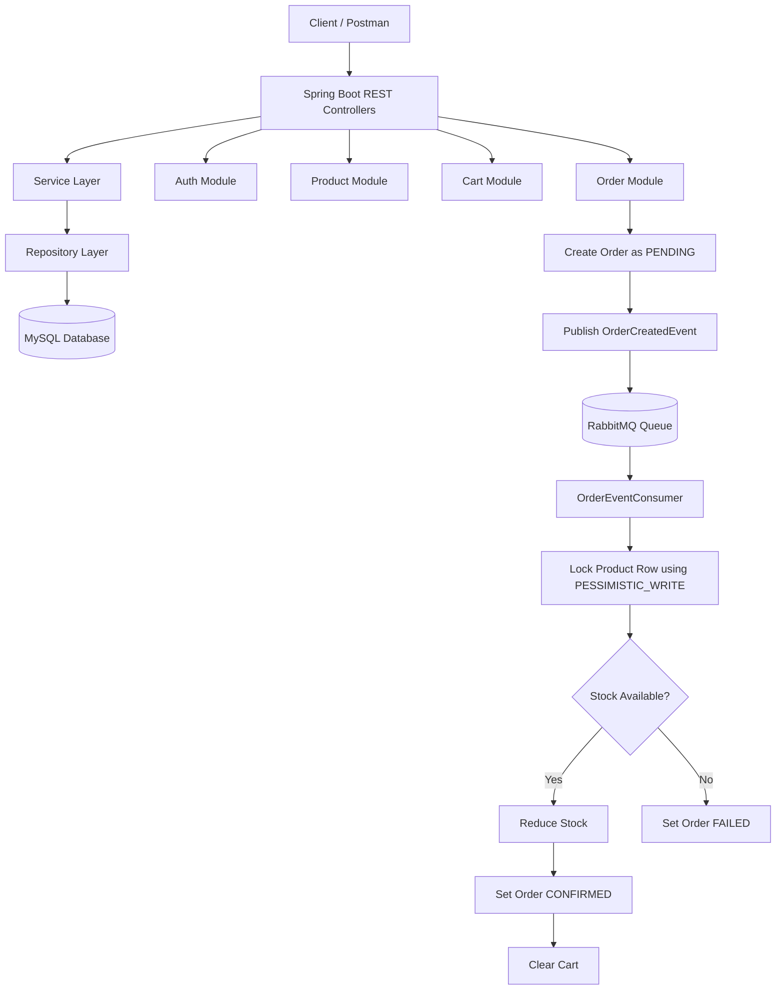

# Spring Boot E-Commerce Backend

### A production-style e-commerce backend built with Spring Boot, JWT authentication, MySQL, Redis caching, database locking, and RabbitMQ-based asynchronous order processing.

---

## 📖 Table of Contents

- [Overview](#-overview)
- [Module Breakdown](#-module-breakdown)
- [Database Design](#-database-design)
- [API Endpoints](#-api-endpoints)
- [Order Processing Flow](#-order-processing-flow)
- [Architecture Diagram](#-architecture-diagram)
- [Getting Started](#-getting-started)
- [Configuration Reference](#-configuration-reference)
- [Postman Testing Flow](#-postman-testing-flow)
- [Security Considerations](#-security-considerations)
- [License](#-license)

---

## 🎯 Overview

This project is a backend system for an e-commerce platform. It provides REST APIs for user authentication, product management, cart management, and order processing. 

Key capabilities include:
*   Users can register and log in securely.
*   Admins can manage the product catalog.
*   Users can add products to their carts.
*   Users can place orders.
*   Orders are processed asynchronously using **RabbitMQ**.
*   Product stock is protected using database **Pessimistic Locking**.
*   Frequently accessed catalog data is optimized with **Redis Caching**.

---

## 📦 Module Breakdown

### Auth Module
*   **Register User:** Allows new users to register.
*   **Login User:** Validates credentials and returns JWT.
*   **Generate JWT Token:** Issues tokens containing the user's email and role.
*   **Encrypt Password using BCrypt:** Securely hashes passwords before storing them in MySQL.
*   **Separate USER and ADMIN Roles:** Separates access controls using Spring Security authority guards.

### Product Module
*   **Public Users Can View Products:** No authentication required to fetch all products or individual product details.
*   **Admin Can Create, Update, Delete Products:** Restricted endpoints requiring admin credentials.
*   **Rich Product Fields:** Full support for `name`, `description`, `price`, `stock`, `category`, and `imageUrl`.

### Cart Module
*   **Logged-In Users Can Add Products:** Secure add-to-cart operations identified directly by the user's JWT.
*   **Cart Belongs to Logged-In User:** Automatic user resolution prevents cross-user access.
*   **Cart Total Recalculation:** The total amount is calculated dynamically using cart item subtotals.
*   **Stock Check Only:** Cart operations validate product stock limits but do not reduce inventory.

### Order Module
*   **Logged-In Users Can Place Orders:** Initiates the checkout sequence.
*   **Starts with PENDING Status:** Initial state signifies the order has been created but not yet fulfilled.
*   **Asynchronous Processing:** Publishes order messages to RabbitMQ, returning an immediate response to the client.
*   **Deferred Stock Reduction:** Inventory is only decremented inside the RabbitMQ consumer on successful checkouts.
*   **Conditional Cart Clearing:** Carts are cleared only after the order transitions to `CONFIRMED`.

### RabbitMQ Module
*   **Decouples Modules:** Separates HTTP order registration from transaction processing.
*   **Improves Scalability:** Enables multiple consumers to process order messages in parallel.
*   **Real-World Flow:** Mirroring the architecture design of major production-level e-commerce systems.

### Stock Locking
*   **Pessimistic DB Locking:** Locks rows via `SELECT ... FOR UPDATE` in the database.
*   **Race Condition Prevention:** Prevents multiple users from purchasing the same remaining stock.
*   **Negative Stock Protection:** Ensures product stock remains safe and never goes below zero.

---

## 🗄️ Database Design

### tables and Fields

#### 1. `users`
*   `id` (BIGINT, Primary Key, AUTO_INCREMENT)
*   `name` (VARCHAR, NOT NULL)
*   `email` (VARCHAR, NOT NULL, UNIQUE)
*   `password` (VARCHAR, NOT NULL)
*   `role` (VARCHAR, NOT NULL)
*   `createdAt` (DATETIME)
*   `updatedAt` (DATETIME)

#### 2. `products`
*   `id` (BIGINT, Primary Key, AUTO_INCREMENT)
*   `name` (VARCHAR, NOT NULL)
*   `description` (TEXT, NOT NULL)
*   `price` (DECIMAL, NOT NULL)
*   `stockQuantity` (INT, NOT NULL)
*   `category` (VARCHAR, NOT NULL)
*   `imageUrl` (VARCHAR)
*   `createdAt` (DATETIME)
*   `updatedAt` (DATETIME)

#### 3. `carts`
*   `id` (BIGINT, Primary Key, AUTO_INCREMENT)
*   `user_id` (BIGINT, Foreign Key, UNIQUE)
*   `totalAmount` (DECIMAL, NOT NULL)
*   `createdAt` (DATETIME)
*   `updatedAt` (DATETIME)

#### 4. `cart_items`
*   `id` (BIGINT, Primary Key, AUTO_INCREMENT)
*   `cart_id` (BIGINT, Foreign Key)
*   `product_id` (BIGINT, Foreign Key)
*   `quantity` (INT, NOT NULL)
*   `price` (DECIMAL, NOT NULL)
*   `subtotal` (DECIMAL, NOT NULL)
*   `createdAt` (DATETIME)
*   `updatedAt` (DATETIME)

#### 5. `orders`
*   `id` (BIGINT, Primary Key, AUTO_INCREMENT)
*   `user_id` (BIGINT, Foreign Key)
*   `totalAmount` (DECIMAL, NOT NULL)
*   `status` (VARCHAR, NOT NULL)
*   `shippingAddress` (VARCHAR, NOT NULL)
*   `phoneNumber` (VARCHAR, NOT NULL)
*   `orderDate` (DATETIME)
*   `createdAt` (DATETIME)
*   `updatedAt` (DATETIME)

#### 6. `order_items`
*   `id` (BIGINT, Primary Key, AUTO_INCREMENT)
*   `order_id` (BIGINT, Foreign Key)
*   `product_id` (BIGINT, Foreign Key)
*   `productName` (VARCHAR, NOT NULL)
*   `productImageUrl` (VARCHAR)
*   `price` (DECIMAL, NOT NULL)
*   `quantity` (INT, NOT NULL)
*   `subtotal` (DECIMAL, NOT NULL)
*   `createdAt` (DATETIME)
*   `updatedAt` (DATETIME)

---

## 🔌 API Endpoints

### Auth APIs
| Method | Endpoint | Access | Description |
| :--- | :--- | :--- | :--- |
| **POST** | `/api/auth/register` | Public | Register a new user |
| **POST** | `/api/auth/login` | Public | Login and receive a JWT token |

### Product APIs
| Method | Endpoint | Access | Description |
| :--- | :--- | :--- | :--- |
| **GET** | `/api/products` | Public | Get all products |
| **GET** | `/api/products/{id}` | Public | Get product by ID |
| **POST** | `/api/products` | ADMIN | Create a new product |
| **PUT** | `/api/products/{id}` | ADMIN | Update product details |
| **DELETE** | `/api/products/{id}` | ADMIN | Delete a product |

### Cart APIs
| Method | Endpoint | Access | Description |
| :--- | :--- | :--- | :--- |
| **GET** | `/api/cart` | USER / ADMIN | View logged-in user's cart |
| **POST** | `/api/cart/add` | USER / ADMIN | Add product to cart |
| **PUT** | `/api/cart/item/{cartItemId}` | USER / ADMIN | Update cart item quantity |
| **DELETE** | `/api/cart/item/{cartItemId}` | USER / ADMIN | Remove cart item |
| **DELETE** | `/api/cart/clear` | USER / ADMIN | Clear cart |

### Order APIs
| Method | Endpoint | Access | Description |
| :--- | :--- | :--- | :--- |
| **POST** | `/api/orders/place` | USER / ADMIN | Place an order |
| **GET** | `/api/orders/my-orders` | USER / ADMIN | View logged-in user's order history |
| **GET** | `/api/orders/{orderId}` | USER / ADMIN | View details of a single order |

---

## 🔄 Order Processing Flow

The backend processes checkouts using the following step-by-step sequence:

*   **Step 1:** User places an order from their cart (`POST /api/orders/place`).
*   **Step 2:** Backend creates the order in MySQL with a **`PENDING`** status.
*   **Step 3:** An `OrderCreatedEvent` is published to **RabbitMQ**. The client receives a fast success response.
*   **Step 4:** The **RabbitMQ consumer** receives the event in the background.
*   **Step 5:** The consumer locks the product rows involved in the order using database **Pessimistic Locking (`FOR UPDATE`)** in ascending order of `productId` to prevent deadlocks.
*   **Step 6: If stock is available:**
    *   Product stock is reduced.
    *   Order status becomes **`CONFIRMED`**.
    *   The user's cart is cleared.
*   **Step 7: If stock is unavailable:**
    *   Order status becomes **`FAILED`**.
    *   The user's cart remains unchanged.
    *   Stock levels remain unchanged.

---

## 🎨 Architecture Diagram

The flowchart below traces the request from client-side execution to database updates and background message listeners:



---

## 🚀 Getting Started

### Prerequisites
*   Java 17 JDK
*   Apache Maven 3.8+
*   MySQL Server 8.x
*   Docker (Optional, recommended for starting Redis & RabbitMQ)

### 1. Initialize Infrastructure (Docker)
```bash
# Start RabbitMQ
docker run -d --hostname rabbitmq-host --name rabbitmq-ecommerce -p 5672:5672 -p 15672:15672 rabbitmq:3-management

# Start Redis
docker run -d --name redis-ecommerce -p 6379:6379 redis:latest
```

### 2. Configure Database
Log into MySQL and execute:
```sql
CREATE DATABASE ecommerce_db CHARACTER SET utf8mb4 COLLATE utf8mb4_unicode_ci;
```

### 3. Setup Properties
Update the database connection details in `src/main/resources/application.properties`:
```properties
spring.datasource.url=jdbc:mysql://localhost:3306/ecommerce_db
spring.datasource.username=YOUR_MYSQL_USERNAME
spring.datasource.password=YOUR_MYSQL_PASSWORD

# Base64-encoded signing key (defaults to fallback raw-bytes padding if invalid Base64)
app.jwt.secret=YOUR_JWT_SECRET_KEY
```

### 4. Build and Run
```bash
# Compile and build the project
mvn clean install -DskipTests

# Start the Spring Boot application
mvn spring-boot:run
```

---

## ⚙️ Configuration Reference

| Property | Default | Description |
|---|---|---|
| `server.port` | `8080` | Tomcat server port |
| `spring.datasource.url` | `jdbc:mysql://localhost:3306/ecommerce_db` | JDBC MySQL connection URL |
| `spring.jpa.hibernate.ddl-auto` | `update` | Automatically creates database schema elements |
| `app.jwt.expiration` | `86400000` | Token validity duration in milliseconds (24h) |
| `spring.data.redis.host` | `localhost` | Redis server hostname |
| `spring.data.redis.port` | `6379` | Redis server port |
| `spring.rabbitmq.host` | `localhost` | RabbitMQ server hostname |
| `spring.rabbitmq.port` | `5672` | RabbitMQ server port |

---

## 📬 Postman Testing Flow

To verify the backend APIs, execute the following requests sequentially:

1.  **Register USER:**
    *   `POST` `http://localhost:8080/api/auth/register`
    *   Payload: `{ "name": "Alice", "email": "alice@example.com", "password": "password123", "role": "USER" }`
2.  **Login USER:**
    *   `POST` `http://localhost:8080/api/auth/login`
    *   Payload: `{ "email": "alice@example.com", "password": "password123" }`
    *   *Action:* Copy the returned `token`.
3.  **Register ADMIN:**
    *   `POST` `http://localhost:8080/api/auth/register`
    *   Payload: `{ "name": "Admin", "email": "admin@example.com", "password": "adminpassword", "role": "ADMIN" }`
4.  **Login ADMIN:**
    *   `POST` `http://localhost:8080/api/auth/login`
    *   Payload: `{ "email": "admin@example.com", "password": "adminpassword" }`
    *   *Action:* Copy the returned admin `token`.
5.  **Admin Creates Product:**
    *   `POST` `http://localhost:8080/api/products` (With Admin Token as Bearer Authorization)
    *   Payload: `{ "name": "Smartphone", "description": "High-end smartphone", "price": 999.00, "stockQuantity": 5, "category": "Electronics" }`
6.  **Add to Cart:**
    *   `POST` `http://localhost:8080/api/cart/add` (With User Token)
    *   Payload: `{ "productId": 1, "quantity": 2 }`
7.  **Place Order:**
    *   `POST` `http://localhost:8080/api/orders/place` (With User Token)
    *   Payload: `{ "shippingAddress": "123 Main St, NY", "phoneNumber": "1234567890" }`
    *   *Expected response status:* **`PENDING`** (Order registered successfully, published to message queue).
8.  **Verify Asynchronous Success:**
    *   `GET` `http://localhost:8080/api/orders/my-orders` (With User Token). The order status should now show **`CONFIRMED`**.
    *   `GET` `http://localhost:8080/api/cart` (With User Token). The cart should be empty.
    *   `GET` `http://localhost:8080/api/products/1` (Public). Product stock should be reduced from `5` to `3`.

---

## 🛡️ Security Considerations

> [!WARNING]
> **Production Guard Checklist**
> *   **Credentials:** Never commit actual DB passwords or JWT secret values. Inject credentials into variables like `SPRING_DATASOURCE_PASSWORD` at startup.
> *   **DDL-Auto Configuration:** Set `spring.jpa.hibernate.ddl-auto` to `none` or `validate` in production environments and manage schema updates via migration tools like Flyway.
> *   **Log Formatting:** Disable `spring.jpa.show-sql` in production to prevent logging SQL parameters.
> *   **JWT Expiry:** Implement shorter token expiration durations paired with refresh token strategies.

---

## 📄 License

Licensed under the MIT License. See [LICENSE](LICENSE) for details.
