#  E-Commerce Platform — Spring Boot Backend

**A production-grade, enterprise-level RESTful e-commerce backend built with Spring Boot 3, Spring Security, JWT authentication, and MySQL. Implements a complete buy-cycle: authentication → product catalog → cart management → order processing.**

<br/>
<div align="center">


<br/>
<br/>

[](https://github.com)[](https://github.com)[](https://github.com)[](https://github.com)

</div>

---

##  Table of Contents

- [Overview](#-overview)
- [Architecture](#-system-architecture)
- [Tech Stack](#-tech-stack)
- [Project Structure](#-project-structure)
- [Database Design](#-database-schema--er-diagram)
- [Security Model](#-security--authentication-flow)
- [API Reference](#-api-reference)
- [Request Lifecycle](#-request-lifecycle)
- [Data Flow Diagrams](#-data-flow-diagrams)
- [Error Handling](#-error-handling)
- [Getting Started](#-getting-started)
- [Configuration](#-configuration-reference)
- [Testing Guide](#-testing-guide)
- [Postman Flow](#-postman-testing-flow)
- [Security Best Practices](#-security-considerations)
- [Contributing](#-contributing)
- [License](#-license)

---

##  Overview

This project is a fully functional **e-commerce REST API backend** built with enterprise-grade practices. It provides all the backbone services needed to power a modern online shopping platform — from secure user authentication to real-time stock management during checkout.

### ✅ Key Capabilities

| Capability | Description |
|---|---|
| 🔐 **Auth & RBAC** | JWT-based stateless auth with `USER` and `ADMIN` role separation |
| 📦 **Product Catalog** | Full CRUD with category filtering and keyword search support |
| 🛒 **Cart Management** | Per-user persistent cart with stock validation and auto-total calculation |
| 🧾 **Order Processing** | Atomic checkout — stock deduction, order creation, and cart clearing in one transaction |
| 🛡️ **Security** | BCrypt password hashing, stateless sessions, per-role endpoint guards |
| ⚠️ **Error Handling** | Centralized `@RestControllerAdvice` with structured JSON error responses |

---

## 🏗️ System Architecture

The application follows a **strict layered architecture** (Controller → Service → Repository), ensuring clean separation of concerns, testability, and maintainability.

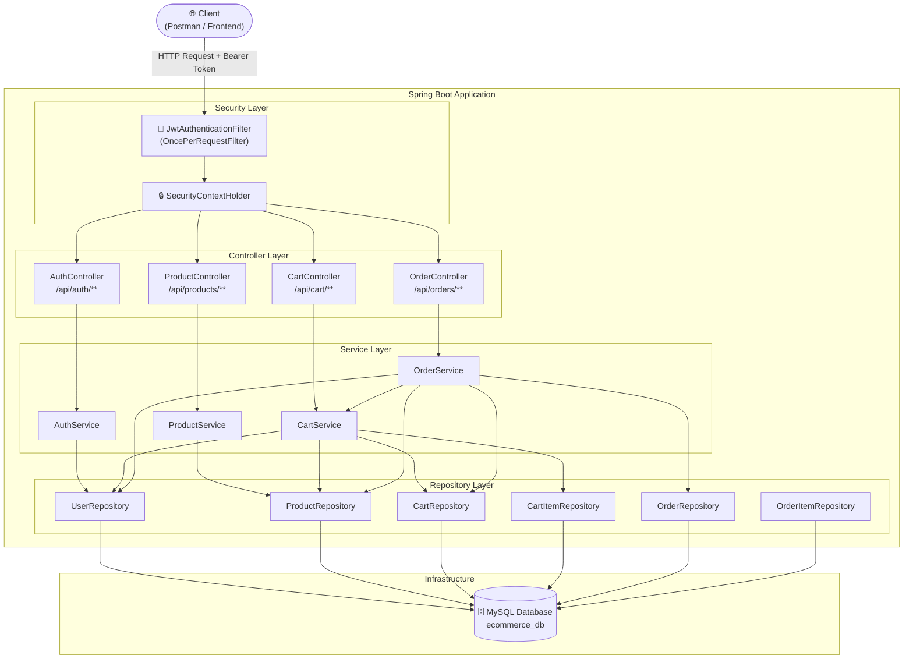

---

## Tech Stack

| Category | Technology | Version | Purpose |
|---|---|---|---|
| **Language** | Java | 17 LTS | Core programming language |
| **Framework** | Spring Boot | 3.2.5 | Application framework & embedded Tomcat |
| **Web** | Spring MVC | 6.x | REST API routing & request handling |
| **Security** | Spring Security | 6.x | Authentication, authorization, filter chain |
| **ORM** | Spring Data JPA / Hibernate | 6.x | Entity-to-table mapping, CRUD operations |
| **Database** | MySQL | 8.0+ | Relational data persistence |
| **Auth Tokens** | JJWT (io.jsonwebtoken) | 0.12.5 | JWT creation, signing, validation |
| **Boilerplate** | Lombok | Latest | Code generation (getters, builders, etc.) |
| **Validation** | Jakarta Bean Validation | 3.x | DTO field validation (`@NotBlank`, `@Min`) |
| **Build Tool** | Apache Maven | 3.9+ | Dependency management & build lifecycle |
| **Testing** | Spring Boot Test + JUnit 5 | Latest | Unit and integration testing |

---

## Project Structure

```
ecommerce-springboot/
│
├── 📄 pom.xml                                          # Maven build config & all dependencies
├── 📄 README.md
│
└── src/
    ├── main/
    │   ├── java/com/ecommerce/
    │   │   │
    │   │   ├──  EcommerceApplication.java            # @SpringBootApplication entry point
    │   │   │
    │   │   ├── config/
    │   │   │   └──  SecurityConfig.java              # Filter chain, RBAC rules, BCrypt bean
    │   │   │
    │   │   ├── controller/                             # HTTP layer — routes & response codes
    │   │   │   ├──  AuthController.java              # POST /api/auth/register|login
    │   │   │   ├──  ProductController.java           # CRUD /api/products/**
    │   │   │   ├──  CartController.java              # Cart ops /api/cart/**
    │   │   │   └──  OrderController.java             # Orders /api/orders/**
    │   │   │
    │   │   ├── dto/                                    # Data Transfer Objects (request/response)
    │   │   │   ├──  RegisterRequest.java             # Inbound: name, email, password, role
    │   │   │   ├──  LoginRequest.java                # Inbound: email, password
    │   │   │   ├──  AuthResponse.java                # Outbound: JWT token + user info
    │   │   │   ├──  ProductRequest.java              # Inbound: product fields w/ validation
    │   │   │   ├──  ProductResponse.java             # Outbound: full product with timestamps
    │   │   │   ├──  AddToCartRequest.java            # Inbound: productId, quantity
    │   │   │   ├──  UpdateCartItemRequest.java       # Inbound: new quantity
    │   │   │   ├──  CartResponse.java                # Outbound: cart + items + total
    │   │   │   ├──  CartItemResponse.java            # Outbound: individual cart item
    │   │   │   ├── PlaceOrderRequest.java           # Inbound: shippingAddress, phoneNumber
    │   │   │   ├──  OrderResponse.java               # Outbound: full order details
    │   │   │   └──  OrderItemResponse.java           # Outbound: individual order item
    │   │   │
    │   │   ├── entity/                                 # JPA Entities → MySQL tables
    │   │   │   ├──  User.java                       # TABLE: users
    │   │   │   ├──  Product.java                    # TABLE: products
    │   │   │   ├──  Cart.java                       # TABLE: carts
    │   │   │   ├──  CartItem.java                   # TABLE: cart_items
    │   │   │   ├──  Order.java                      # TABLE: orders
    │   │   │   ├──  OrderItem.java                  # TABLE: order_items
    │   │   │   ├──  Role.java                       # ENUM: USER | ADMIN
    │   │   │   └──  OrderStatus.java                # ENUM: PENDING | CONFIRMED | CANCELLED
    │   │   │
    │   │   ├── exception/                              # Centralized error handling
    │   │   │   ├── ResourceNotFoundException.java   # Custom 404 exception
    │   │   │   └── GlobalExceptionHandler.java      # @RestControllerAdvice handler
    │   │   │
    │   │   ├── repository/                             # Spring Data JPA interfaces
    │   │   │   ├──  UserRepository.java
    │   │   │   ├──  ProductRepository.java
    │   │   │   ├──  CartRepository.java
    │   │   │   ├──  CartItemRepository.java
    │   │   │   ├──  OrderRepository.java
    │   │   │   └──  OrderItemRepository.java
    │   │   │
    │   │   ├── security/                               # JWT plumbing
    │   │   │   ├──  JwtService.java                 # Token generation & validation (JJWT 0.12.5)
    │   │   │   ├──  JwtAuthenticationFilter.java    # OncePerRequestFilter — token extraction
    │   │   │   └──  CustomUserDetailsService.java   # UserDetailsService bridge to DB
    │   │   │
    │   │   └── service/                               # Business logic layer
    │   │       ├──  AuthService.java                # Register & login logic
    │   │       ├──  ProductService.java             # CRUD + entity↔DTO mapping
    │   │       ├──  CartService.java                # Cart ops + total recalculation
    │   │       └──  OrderService.java               # Checkout, stock deduction, @Transactional
    │   │
    │   └── resources/
    │       └──  application.properties              # DB URL, JWT secret, JPA config
    │
    └── test/
        └── java/com/ecommerce/
            └──  EcommerceApplicationTests.java      # Spring context smoke test
```

---

##  Database Schema & ER Diagram

### Entity Relationship Diagram

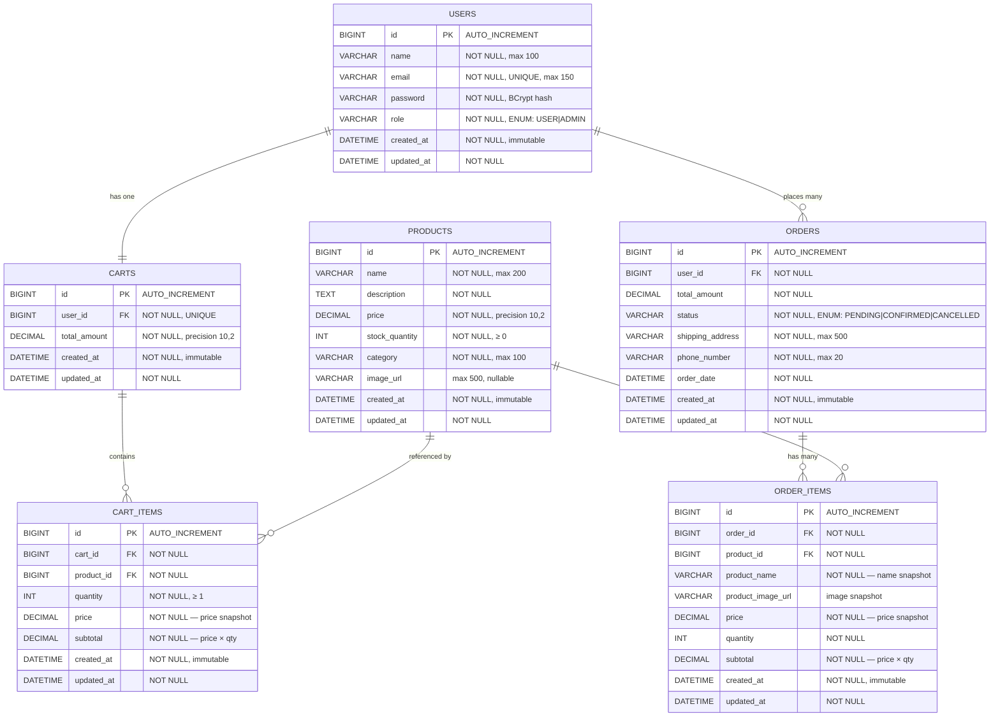

> **Design Note — Snapshot Pattern:** `ORDER_ITEMS` stores `product_name`, `product_image_url`, and `price` as snapshots at checkout time. This ensures historical order records remain accurate even if the product is later updated or deleted by an admin.

---

##  Security & Authentication Flow

### JWT Authentication Lifecycle

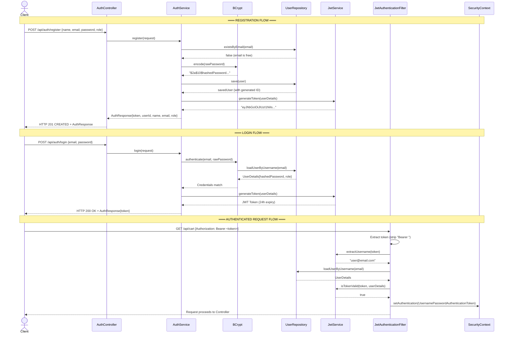

### Endpoint Access Control Matrix

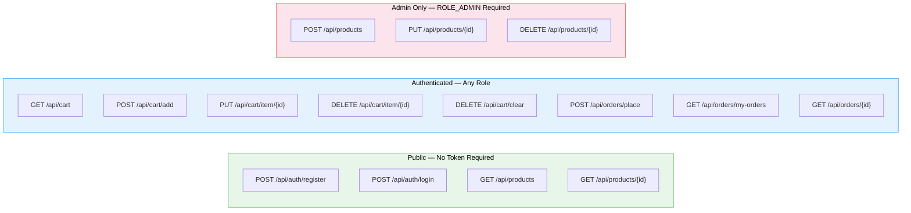

---

##  API Reference

###  Authentication — `/api/auth`

<details>
<summary><code>POST</code> <code><b>/api/auth/register</b></code> — Register a new user</summary>

**Request Body**
```json
{
  "name": "John Doe",
  "email": "john@example.com",
  "password": "securePass123",
  "role": "USER"
}
```

**Validation Rules**
| Field | Rule |
|---|---|
| `name` | `@NotBlank` — Required |
| `email` | `@NotBlank` + `@Email` — Valid email format |
| `password` | `@NotBlank` + `@Size(min=6)` — Minimum 6 characters |
| `role` | Optional — defaults to `USER` if omitted. Accepts `USER` or `ADMIN` |

**Response** — `201 Created`
```json
{
  "token": "eyJhbGciOiJIUzI1NiIsInR5cCI6IkpXVCJ9...",
  "tokenType": "Bearer",
  "userId": 1,
  "name": "John Doe",
  "email": "john@example.com",
  "role": "USER"
}
```
</details>

<details>
<summary><code>POST</code> <code><b>/api/auth/login</b></code> — Authenticate and get JWT token</summary>

**Request Body**
```json
{
  "email": "john@example.com",
  "password": "securePass123"
}
```

**Response** — `200 OK`
```json
{
  "token": "eyJhbGciOiJIUzI1NiIsInR5cCI6IkpXVCJ9...",
  "tokenType": "Bearer",
  "userId": 1,
  "name": "John Doe",
  "email": "john@example.com",
  "role": "USER"
}
```
</details>

---

###  Products — `/api/products`

> `GET` endpoints are public. `POST`, `PUT`, `DELETE` require `Authorization: Bearer <ADMIN_TOKEN>`.

<details>
<summary><code>GET</code> <code><b>/api/products</b></code> — List all products (Public)</summary>

**Response** — `200 OK`
```json
[
  {
    "id": 1,
    "name": "iPhone 15",
    "description": "Apple iPhone 15 with 128GB storage",
    "price": 79999.00,
    "stockQuantity": 10,
    "category": "Mobile",
    "imageUrl": "https://example.com/iphone15.jpg",
    "createdAt": "2026-05-01T10:00:00",
    "updatedAt": "2026-05-01T10:00:00"
  }
]
```
</details>

<details>
<summary><code>GET</code> <code><b>/api/products/{id}</b></code> — Get single product (Public)</summary>

**Path Parameter:** `id` — Product ID (Long)

**Response** — `200 OK` | `404 Not Found`
</details>

<details>
<summary><code>POST</code> <code><b>/api/products</b></code> — Create product <code>[ADMIN]</code></summary>

**Headers:** `Authorization: Bearer <ADMIN_TOKEN>`

**Request Body**
```json
{
  "name": "MacBook Pro 14",
  "description": "Apple MacBook Pro with M3 chip, 16GB RAM",
  "price": 199999.00,
  "stockQuantity": 5,
  "category": "Laptop",
  "imageUrl": "https://example.com/macbook-pro.jpg"
}
```

**Validation Rules**
| Field | Rule |
|---|---|
| `name` | `@NotBlank` |
| `description` | `@NotBlank` |
| `price` | `@NotNull` + `@Positive` — Must be > 0 |
| `stockQuantity` | `@NotNull` + `@PositiveOrZero` — Must be ≥ 0 |
| `category` | `@NotBlank` |
| `imageUrl` | Optional |

**Response** — `201 Created`
</details>

<details>
<summary><code>PUT</code> <code><b>/api/products/{id}</b></code> — Update product <code>[ADMIN]</code></summary>

**Headers:** `Authorization: Bearer <ADMIN_TOKEN>` | Same body as `POST /api/products`

**Response** — `200 OK` | `404 Not Found`
</details>

<details>
<summary><code>DELETE</code> <code><b>/api/products/{id}</b></code> — Delete product <code>[ADMIN]</code></summary>

**Headers:** `Authorization: Bearer <ADMIN_TOKEN>`

**Response** — `204 No Content` | `404 Not Found`
</details>

---

### 🛒 Cart — `/api/cart`

> All cart endpoints require `Authorization: Bearer <USER_TOKEN>`.

<details>
<summary><code>GET</code> <code><b>/api/cart</b></code> — View current user's cart</summary>

**Response** — `200 OK`
```json
{
  "cartId": 1,
  "userId": 2,
  "items": [
    {
      "cartItemId": 3,
      "productId": 1,
      "productName": "iPhone 15",
      "productImageUrl": "https://example.com/iphone15.jpg",
      "price": 79999.00,
      "quantity": 2,
      "subtotal": 159998.00
    }
  ],
  "totalAmount": 159998.00,
  "totalItems": 2
}
```
</details>

<details>
<summary><code>POST</code> <code><b>/api/cart/add</b></code> — Add product to cart</summary>

**Request Body**
```json
{
  "productId": 1,
  "quantity": 2
}
```
If the product is already in the cart, the quantity is **incremented** (not duplicated). Stock availability is validated before adding.

**Response** — `200 OK` — Full updated `CartResponse`
</details>

<details>
<summary><code>PUT</code> <code><b>/api/cart/item/{cartItemId}</b></code> — Update item quantity</summary>

**Request Body**
```json
{
  "quantity": 5
}
```
**Response** — `200 OK` — Full updated `CartResponse`
</details>

<details>
<summary><code>DELETE</code> <code><b>/api/cart/item/{cartItemId}</b></code> — Remove single item</summary>

**Response** — `200 OK`
</details>

<details>
<summary><code>DELETE</code> <code><b>/api/cart/clear</b></code> — Clear entire cart</summary>

**Response** — `200 OK`
</details>

---

### 🧾 Orders — `/api/orders`

> All order endpoints require `Authorization: Bearer <USER_TOKEN>`.

<details>
<summary><code>POST</code> <code><b>/api/orders/place</b></code> — Checkout and place order</summary>

**Request Body**
```json
{
  "shippingAddress": "42 MG Road, Bangalore, Karnataka - 560001",
  "phoneNumber": "9876543210"
}
```

**Validation Rules**
| Field | Rule |
|---|---|
| `shippingAddress` | `@NotBlank` |
| `phoneNumber` | `@NotBlank` + `@Pattern(^\\d{10}$)` — Exactly 10 digits |

**What happens atomically (`@Transactional`):**
1. Validates that the cart is not empty
2. Checks stock availability for every item
3. Deducts stock from each product
4. Creates `Order` + `OrderItem` records with price snapshots
5. Calculates total amount
6. Clears the cart

**Response** — `201 Created` — Full `OrderResponse`
</details>

<details>
<summary><code>GET</code> <code><b>/api/orders/my-orders</b></code> — View order history</summary>

**Response** — `200 OK` — Array of `OrderResponse`, sorted newest first
</details>

<details>
<summary><code>GET</code> <code><b>/api/orders/{orderId}</b></code> — Get specific order</summary>

Authorization-boundary enforced: users can only view their own orders.

**Response** — `200 OK` | `404 Not Found`
</details>

---

## 🔄 Request Lifecycle

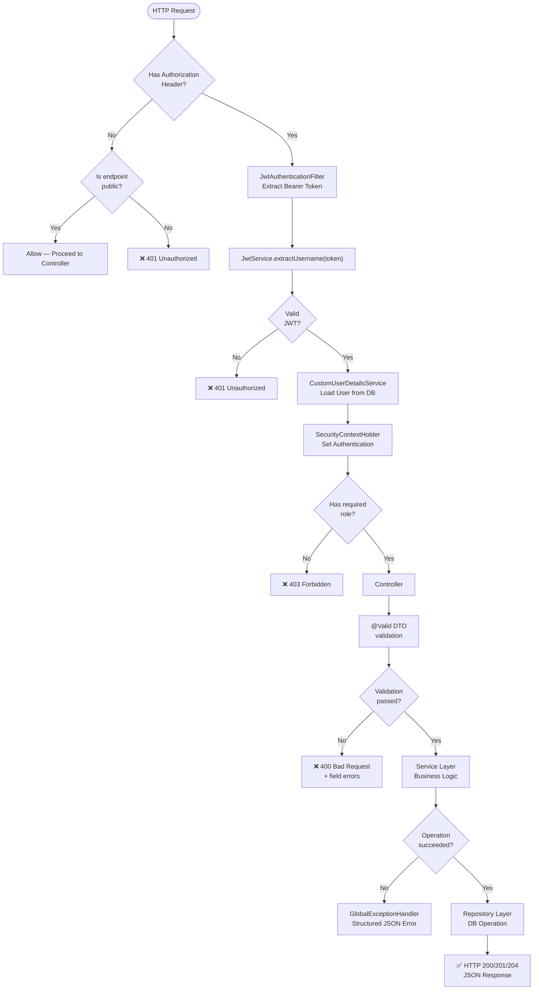

---

## 🔁 Data Flow Diagrams

### Order Placement Flow (Transactional)

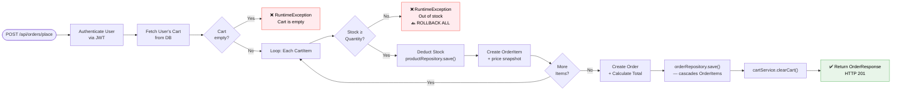

### Cart Add-to-Cart Flow

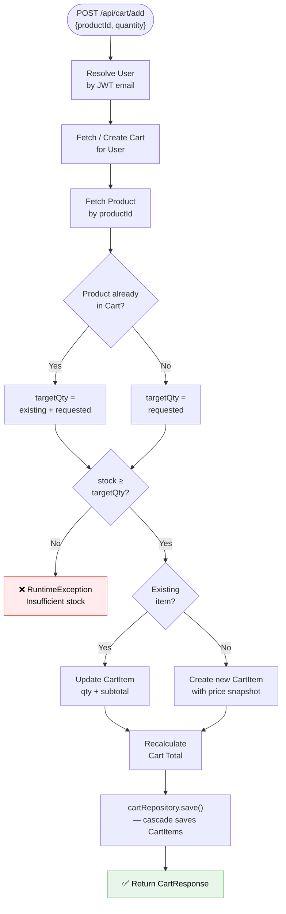

---

## ⚠️ Error Handling

All errors are handled centrally via `GlobalExceptionHandler` (`@RestControllerAdvice`) and return a consistent JSON structure.

### Error Response Structure

```json
{
  "status": 404,
  "message": "Product not found with id: 99",
  "timestamp": "2026-05-27T10:30:00.123"
}
```

### Validation Error Structure (`400`)

```json
{
  "status": 400,
  "message": "Validation failed",
  "errors": {
    "price": "Price must be greater than 0",
    "name": "Product name is required"
  },
  "timestamp": "2026-05-27T10:31:00.456"
}
```

### Exception → HTTP Status Mapping

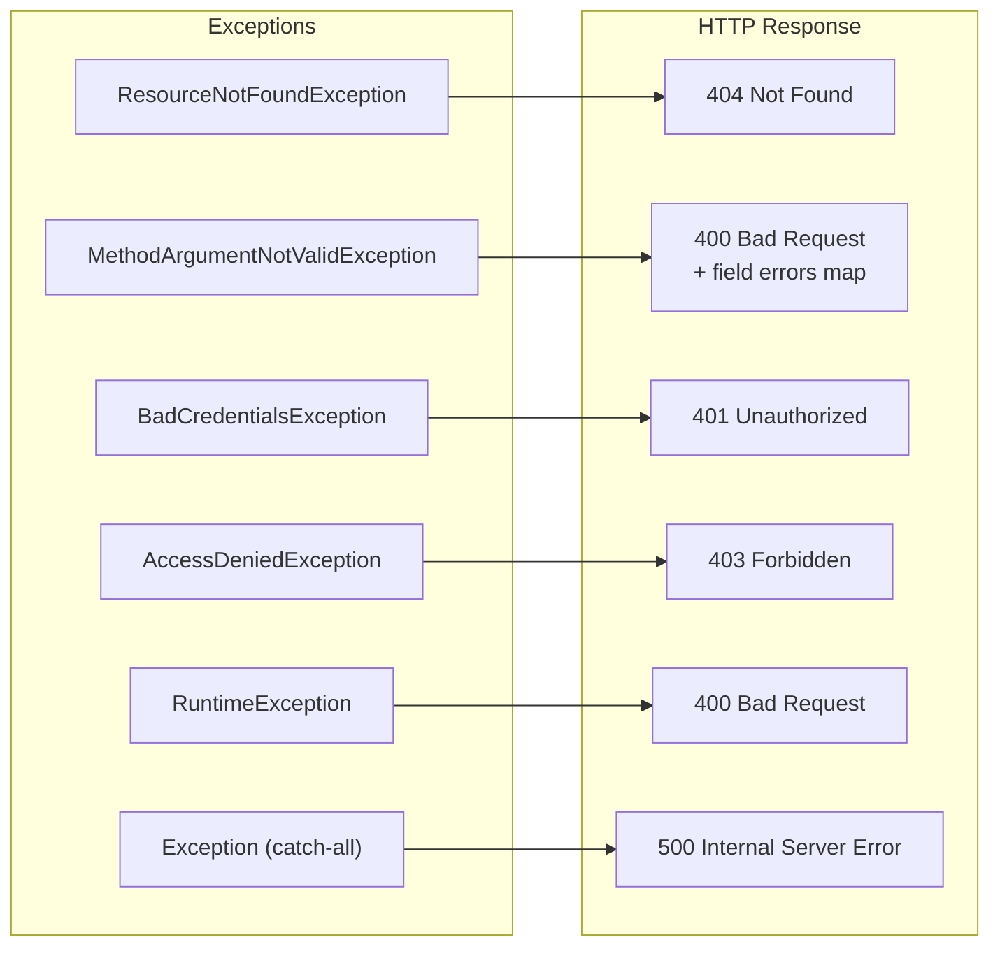

---

##  Getting Started

### Prerequisites

Ensure the following are installed and configured:

| Tool | Minimum Version | Check Command |
|---|---|---|
| JDK | 17+ | `java -version` |
| Apache Maven | 3.9+ | `mvn -version` |
| MySQL Server | 8.0+ | `mysql --version` |
| Git | Any | `git --version` |

### Step 1 — Clone the Repository

```bash
git clone https://github.com/your-username/ecommerce-springboot.git
cd ecommerce-springboot
```

### Step 2 — Create the MySQL Database

Connect to your MySQL server and run:

```sql
CREATE DATABASE ecommerce_db CHARACTER SET utf8mb4 COLLATE utf8mb4_unicode_ci;
```

> **Note:** Hibernate's `ddl-auto=update` will automatically create all required tables (`users`, `products`, `carts`, `cart_items`, `orders`, `order_items`) on first startup.

### Step 3 — Configure Application Properties

Edit `src/main/resources/application.properties`:

```properties
# ─── Database ───────────────────────────────────────────────
spring.datasource.url=jdbc:mysql://localhost:3306/ecommerce_db
spring.datasource.username=YOUR_MYSQL_USERNAME
spring.datasource.password=YOUR_MYSQL_PASSWORD

# ─── JWT ────────────────────────────────────────────────────
# Must be a Base64-encoded string of at least 256 bits (32 bytes)
app.jwt.secret=YOUR_BASE64_ENCODED_256BIT_SECRET
app.jwt.expiration=86400000   # 24 hours in milliseconds
```

**Generate a secure JWT secret key:**
```bash
# Option 1 — OpenSSL
openssl rand -base64 32

# Option 2 — Node.js
node -e "console.log(require('crypto').randomBytes(32).toString('base64'))"
```

### Step 4 — Build & Run

```bash
# Build without running tests
mvn clean install -DskipTests

# Start the application
mvn spring-boot:run
```

The server starts on **`http://localhost:8080`**

### Step 5 — Verify Startup

```bash
# Should return JSON array (may be empty on first run)
curl http://localhost:8080/api/products
```

---

## ⚙️ Configuration Reference

| Property | Default | Description |
|---|---|---|
| `server.port` | `8080` | HTTP port the embedded Tomcat listens on |
| `spring.datasource.url` | — | JDBC connection URL to MySQL |
| `spring.datasource.username` | — | MySQL username |
| `spring.datasource.password` | — | MySQL password |
| `spring.jpa.hibernate.ddl-auto` | `update` | Schema strategy — use `none` in production |
| `spring.jpa.show-sql` | `true` | Print SQL queries to console |
| `spring.jpa.properties.hibernate.format_sql` | `true` | Pretty-print SQL |
| `spring.jpa.database-platform` | `MySQLDialect` | Hibernate SQL dialect |
| `app.jwt.secret` | — | Base64-encoded HMAC-SHA256 signing key |
| `app.jwt.expiration` | `86400000` | Token lifetime in milliseconds (24h) |

---

## 🧪 Testing Guide

### Running Tests

```bash
# Run all tests
mvn test

# Run a specific test class
mvn test -Dtest=EcommerceApplicationTests

# Run with verbose output
mvn test -Dtest=EcommerceApplicationTests -pl . -am
```

### Test Coverage Areas

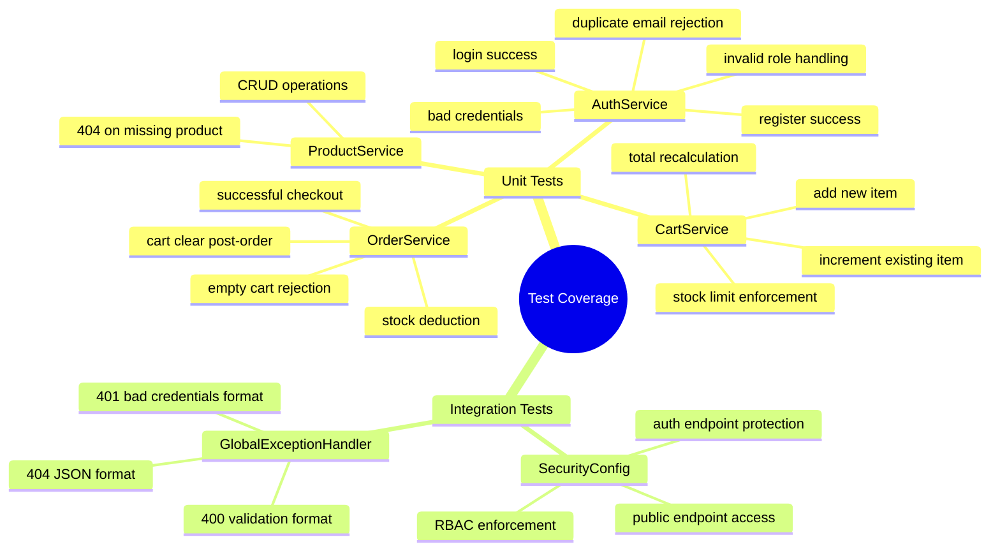

---

## 📬 Postman Testing Flow

Follow this sequence to test the complete e-commerce lifecycle:

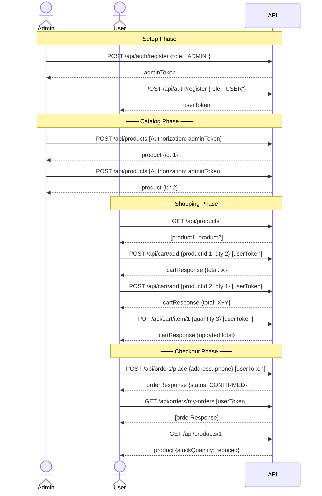

### Setting Up Postman Authorization

1. After login, copy the `token` value from the response
2. In Postman, go to your request → **Authorization** tab
3. Select **Bearer Token** from the Type dropdown
4. Paste the token in the Token field

---

##  Security Considerations

> [!WARNING]
> **Critical for Production Deployment**

| Concern | Development | Production Recommendation |
|---|---|---|
| **JWT Secret** | Hardcoded in `.properties` | Use environment variable or secrets manager (AWS Secrets Manager, HashiCorp Vault) |
| **DB Credentials** | Hardcoded in `.properties` | Inject via environment variables (`SPRING_DATASOURCE_PASSWORD`) |
| **`ddl-auto`** | `update` | Set to `none` or `validate`; use Flyway/Liquibase for migrations |
| **`show-sql`** | `true` | Set to `false` to avoid SQL in logs |
| **HTTPS** | Not configured | Terminate TLS at load balancer or configure Spring SSL |
| **CORS** | Not configured | Add `CorsConfigurationSource` bean to `SecurityConfig` |
| **Rate Limiting** | Not implemented | Add Bucket4j or API Gateway rate limiting |
| **Role Validation** | Registration accepts `ADMIN` via API | Restrict admin role creation to internal processes only |

> [!CAUTION]
> Never commit real credentials to version control. Add `application-local.properties` to `.gitignore` and use Spring profiles for environment-specific config.

---

## 🗺️ Domain Model Overview

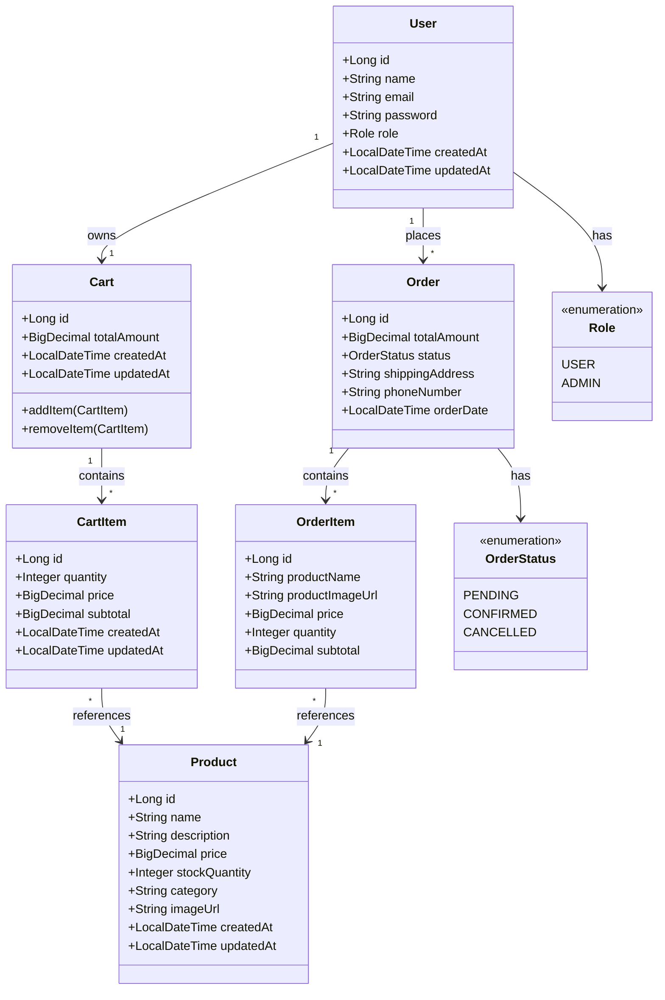

---

## 🤝 Contributing

Contributions are welcome! Please follow the workflow below:

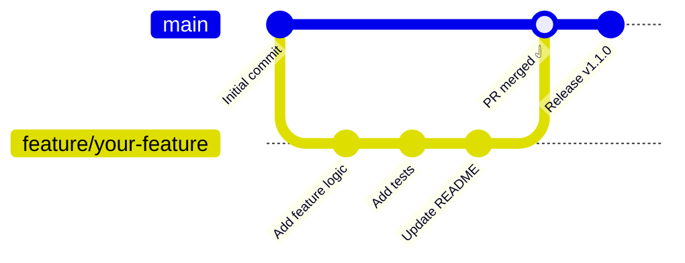

### Contribution Steps

1. **Fork** the repository
2. **Create** a feature branch: `git checkout -b feature/payment-gateway`
3. **Commit** your changes: `git commit -m "feat: add Razorpay payment integration"`
4. **Push** to the branch: `git push origin feature/payment-gateway`
5. **Open a Pull Request** against `main`

### Commit Message Convention

Follow [Conventional Commits](https://www.conventionalcommits.org/):

```
feat:     New feature
fix:      Bug fix
docs:     Documentation only
refactor: Code refactor without behavior change
test:     Adding or updating tests
chore:    Build system, dependencies
```

---

## 📈 Planned Enhancements

| Feature | Priority | Status |
|---|---|---|
| Payment gateway integration (Razorpay / Stripe) | 🔴 High | 📋 Planned |
| Product search & category filter endpoints | 🔴 High | 📋 Planned |
| Admin order status management (CONFIRMED → SHIPPED) | 🟡 Medium | 📋 Planned |
| Email notifications on order placement | 🟡 Medium | 📋 Planned |
| Refresh token support | 🟡 Medium | 📋 Planned |
| Docker + Docker Compose setup | 🟢 Low | 📋 Planned |
| Swagger / OpenAPI documentation | 🟢 Low | 📋 Planned |
| Redis caching for product catalog | 🟢 Low | 📋 Planned |

---

## 📄 License

This project is licensed under the **MIT License** — see the [LICENSE](LICENSE) file for details.

```
MIT License

Copyright (c) 2026

Permission is hereby granted, free of charge, to any person obtaining a copy
of this software and associated documentation files (the "Software"), to deal
in the Software without restriction, including without limitation the rights
to use, copy, modify, merge, publish, distribute, sublicense, and/or sell
copies of the Software...
```

---

<div align="center">

**Built with ❤️ using Spring Boot · MySQL · Spring Security · JWT**

[](https://openjdk.org/)
[](https://spring.io/projects/spring-boot)
[](https://www.mysql.com/)

</div>
