# E-Commerce Platform using Spring Boot

**A production-grade RESTful e-commerce backend built with Spring Boot 3.2.5, Java 17, Spring Security, JWT authentication, MySQL, Redis caching, RabbitMQ messaging, and asynchronous order processing. The system implements a complete commerce workflow covering authentication, role-based authorization, product catalog management, cart operations, order creation, inventory locking, and background order confirmation.**

<br/>
<div align="center">


<br/>
<br/>

[](https://github.com)
[](https://github.com)
[](https://github.com)
[](https://github.com)
[](https://github.com)
[](LICENSE)

</div>

---

## Table of Contents

- [Overview](#overview)
- [Business Capabilities](#business-capabilities)
- [System Architecture](#system-architecture)
- [Technology Stack](#technology-stack)
- [Project Structure](#project-structure)
- [Domain Model](#domain-model)
- [Database Schema and ER Diagram](#database-schema-and-er-diagram)
- [Security and Authentication Model](#security-and-authentication-model)
- [Caching Strategy](#caching-strategy)
- [Messaging and Async Order Processing](#messaging-and-async-order-processing)
- [Inventory Consistency and Locking](#inventory-consistency-and-locking)
- [API Reference](#api-reference)
- [Request Lifecycle](#request-lifecycle)
- [Error Handling](#error-handling)
- [Getting Started](#getting-started)
- [Configuration Reference](#configuration-reference)
- [Local Development with Docker](#local-development-with-docker)
- [Testing Guide](#testing-guide)
- [Postman Execution Flow](#postman-execution-flow)
- [Production Readiness Checklist](#production-readiness-checklist)
- [Known Constraints](#known-constraints)
- [Future Enhancements](#future-enhancements)
- [Contributing](#contributing)
- [License](#license)

---

## Overview

This project is a backend-only e-commerce platform designed around real-world service-layer responsibilities. It exposes REST APIs for users, administrators, carts, products, and orders. The implementation follows a layered Spring Boot architecture and uses Redis and RabbitMQ to demonstrate performance optimization and asynchronous processing patterns used in enterprise systems.

The application is not only a simple CRUD backend. It includes the following production-style concepts:

| Area | Implementation |
|---|---|
| Authentication | JWT-based stateless login and registration |
| Authorization | Role-based access control with `USER` and `ADMIN` roles |
| Product Catalog | Public product browsing with admin-only product management |
| Cart Management | Authenticated per-user cart with item quantity management |
| Order Processing | Order creation as `PENDING`, followed by asynchronous background confirmation |
| Cache Layer | Redis-backed product list and product detail caching |
| Messaging Layer | RabbitMQ event publishing and consuming for order processing |
| Inventory Safety | Pessimistic write lock on products during stock deduction |
| Persistence | MySQL with Spring Data JPA and Hibernate |
| Error Handling | Centralized `@RestControllerAdvice` error response handling |

---

## Business Capabilities

| Capability | Description | Primary Components |
|---|---|---|
| User registration | Creates a new user account and returns JWT token | `AuthController`, `AuthService`, `UserRepository` |
| User login | Authenticates credentials and returns JWT token | `AuthService`, `AuthenticationManager`, `JwtService` |
| Product creation | Allows admin users to create products | `ProductController`, `ProductService` |
| Product browsing | Allows public users to view products | `ProductController`, Redis cache |
| Cart operations | Allows users to add, update, remove, and clear cart items | `CartController`, `CartService` |
| Order placement | Converts cart into an order with `PENDING` status | `OrderController`, `OrderService` |
| Async order processing | Confirms or fails orders through RabbitMQ consumer | `OrderEventPublisher`, `OrderEventConsumer` |
| Stock consistency | Uses database-level pessimistic lock during stock deduction | `ProductRepository.findByIdForUpdate` |

---

## System Architecture

The project follows a clean layered architecture with a dedicated security filter, service layer, repository layer, cache layer, and messaging layer.

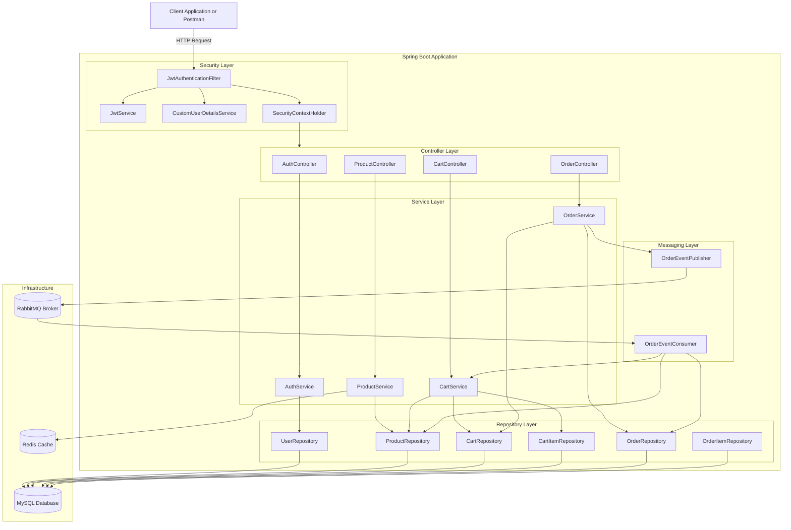

---

## Technology Stack

| Category | Technology | Version or Module | Purpose |
|---|---|---|---|
| Language | Java | 17 | Main backend programming language |
| Framework | Spring Boot | 3.2.5 | Application framework and auto-configuration |
| Web Layer | Spring MVC | Spring Boot Starter Web | REST API development |
| Security | Spring Security | Spring Boot Starter Security | Authentication and authorization |
| Token Library | JJWT | 0.12.5 | JWT generation and validation |
| Persistence | Spring Data JPA | Hibernate 6 | ORM and repository abstraction |
| Database | MySQL | 8.x recommended | Relational database |
| Cache | Redis | Spring Data Redis | Product cache and response acceleration |
| Messaging | RabbitMQ | Spring AMQP | Async order processing |
| Validation | Jakarta Validation | Spring Boot Starter Validation | Request DTO validation |
| Build Tool | Maven | Spring Boot Maven Plugin | Dependency management and packaging |
| Boilerplate Reduction | Lombok | Compile-time | Getters, setters, builders, constructors |
| Testing | JUnit 5 | Spring Boot Starter Test | Unit and integration testing |

---

## Project Structure

```text
E-commerce-platform-using-springboot-main/
|
|-- pom.xml
|-- README.md
|-- step_by_step_test.ps1
|-- verify_cart.ps1
|-- verify_order.ps1
|
`-- src/
    |-- main/
    |   |-- java/com/ecommerce/
    |   |   |
    |   |   |-- EcommerceApplication.java
    |   |   |
    |   |   |-- config/
    |   |   |   |-- SecurityConfig.java
    |   |   |   |-- RedisConfig.java
    |   |   |   `-- RabbitMQConfig.java
    |   |   |
    |   |   |-- controller/
    |   |   |   |-- AuthController.java
    |   |   |   |-- ProductController.java
    |   |   |   |-- CartController.java
    |   |   |   `-- OrderController.java
    |   |   |
    |   |   |-- dto/
    |   |   |   |-- RegisterRequest.java
    |   |   |   |-- LoginRequest.java
    |   |   |   |-- AuthResponse.java
    |   |   |   |-- ProductRequest.java
    |   |   |   |-- ProductResponse.java
    |   |   |   |-- AddToCartRequest.java
    |   |   |   |-- UpdateCartItemRequest.java
    |   |   |   |-- CartResponse.java
    |   |   |   |-- CartItemResponse.java
    |   |   |   |-- PlaceOrderRequest.java
    |   |   |   |-- OrderResponse.java
    |   |   |   |-- OrderItemResponse.java
    |   |   |   `-- OrderCreatedEvent.java
    |   |   |
    |   |   |-- entity/
    |   |   |   |-- User.java
    |   |   |   |-- Role.java
    |   |   |   |-- Product.java
    |   |   |   |-- Cart.java
    |   |   |   |-- CartItem.java
    |   |   |   |-- Order.java
    |   |   |   |-- OrderItem.java
    |   |   |   `-- OrderStatus.java
    |   |   |
    |   |   |-- exception/
    |   |   |   |-- ResourceNotFoundException.java
    |   |   |   `-- GlobalExceptionHandler.java
    |   |   |
    |   |   |-- messaging/
    |   |   |   |-- OrderEventPublisher.java
    |   |   |   `-- OrderEventConsumer.java
    |   |   |
    |   |   |-- repository/
    |   |   |   |-- UserRepository.java
    |   |   |   |-- ProductRepository.java
    |   |   |   |-- CartRepository.java
    |   |   |   |-- CartItemRepository.java
    |   |   |   |-- OrderRepository.java
    |   |   |   `-- OrderItemRepository.java
    |   |   |
    |   |   |-- security/
    |   |   |   |-- JwtService.java
    |   |   |   |-- JwtAuthenticationFilter.java
    |   |   |   `-- CustomUserDetailsService.java
    |   |   |
    |   |   `-- service/
    |   |       |-- AuthService.java
    |   |       |-- ProductService.java
    |   |       |-- CartService.java
    |   |       `-- OrderService.java
    |   |
    |   `-- resources/
    |       `-- application.properties
    |
    `-- test/
        `-- java/com/ecommerce/
            `-- EcommerceApplicationTests.java
```

---

## Domain Model

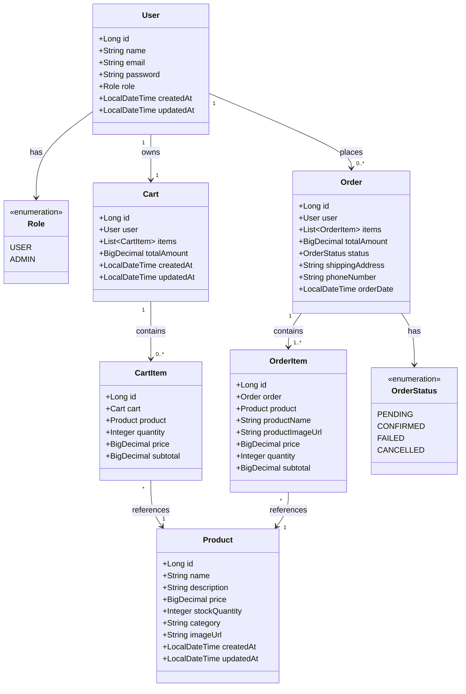

---

## Database Schema and ER Diagram

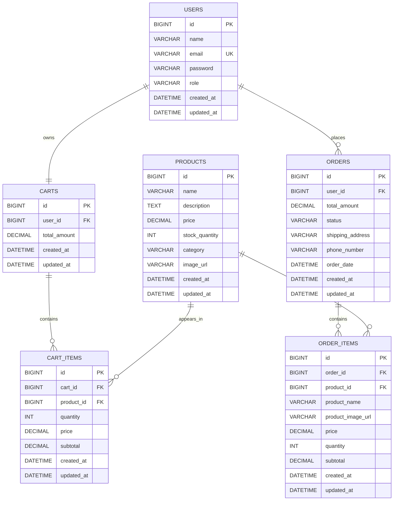

### Data Design Notes

| Design Decision | Reason |
|---|---|
| `email` is unique in `users` | Prevents duplicate accounts and supports login lookup |
| Password is stored as BCrypt hash | Raw passwords are never persisted |
| `OrderItem` stores `productName`, `productImageUrl`, and `price` | Maintains historical order accuracy even if product data changes later |
| Cart item stores price and subtotal | Gives stable cart calculation and fast response mapping |
| Order starts as `PENDING` | Enables asynchronous processing through RabbitMQ |
| Product stock update uses pessimistic locking | Prevents overselling during concurrent order processing |

---

## Security and Authentication Model

The application uses stateless JWT authentication. After registration or login, the client receives a signed JWT token. For protected endpoints, the token must be sent in the `Authorization` header.

```http
Authorization: Bearer <JWT_TOKEN>
```

### Security Access Matrix

| Endpoint Group | HTTP Methods | Access Level |
|---|---:|---|
| `/api/auth/**` | `POST` | Public |
| `/api/products` | `GET` | Public |
| `/api/products/{id}` | `GET` | Public |
| `/api/products` | `POST` | Admin only |
| `/api/products/{id}` | `PUT`, `DELETE` | Admin only |
| `/api/cart/**` | All | Authenticated user |
| `/api/orders/**` | All | Authenticated user |
| Any other endpoint | All | Authenticated user |

### Authentication Flow

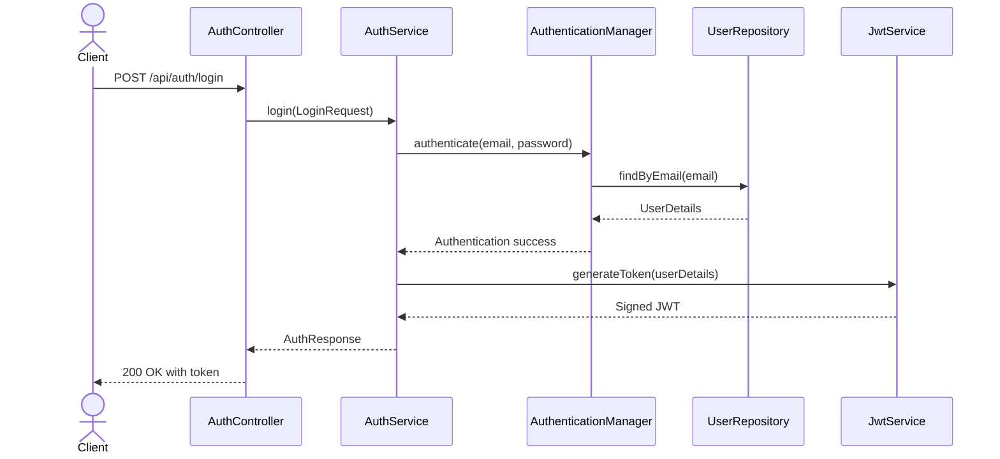

### Protected Request Flow

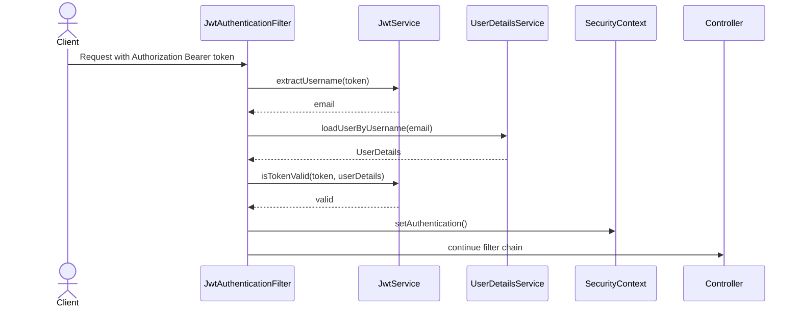

---

## Caching Strategy

Redis is used as a cache layer for product read operations. Product data is highly read-heavy in e-commerce systems, so caching reduces repeated MySQL hits.

### Cached Operations

| Service Method | Cache Name | Cache Key | Behavior |
|---|---|---|---|
| `getAllProducts()` | `products` | default | Caches full product list |
| `getProductById(Long id)` | `product` | `id` | Caches individual product by ID |
| `createProduct()` | `products` | all entries | Evicts product list cache |
| `updateProduct(Long id)` | `products`, `product` | all entries and `id` | Evicts stale list and item cache |
| `deleteProduct(Long id)` | `products`, `product` | all entries and `id` | Evicts stale list and item cache |

### Redis Cache Flow

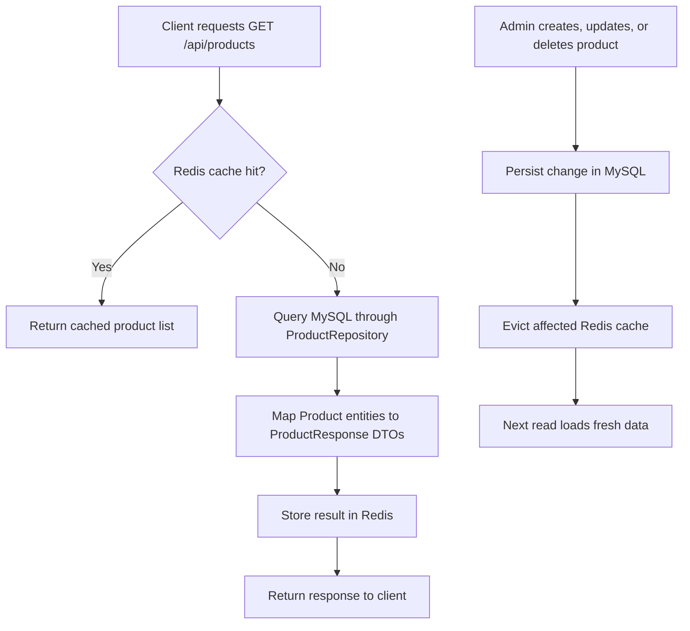

### Cache Configuration

| Property | Value |
|---|---|
| Redis host | `localhost` |
| Redis port | `6379` |
| Cache TTL | `600000 ms` / 10 minutes |
| Key serializer | `StringRedisSerializer` |
| Value serializer | `GenericJackson2JsonRedisSerializer` |

---

## Messaging and Async Order Processing

RabbitMQ is used to decouple order creation from order processing. The API creates an order quickly and returns a `PENDING` status. The actual stock validation, stock deduction, confirmation, and cart clearing happen in the background.

### RabbitMQ Topology

| Component | Value | Purpose |
|---|---|---|
| Exchange | `order.exchange` | Receives order events |
| Queue | `order.queue` | Stores order processing messages |
| Routing Key | `order.created` | Routes order-created events to queue |
| Producer | `OrderEventPublisher` | Publishes `OrderCreatedEvent` |
| Consumer | `OrderEventConsumer` | Processes order asynchronously |
| Converter | `Jackson2JsonMessageConverter` | Serializes event objects as JSON |

### Async Order Flow

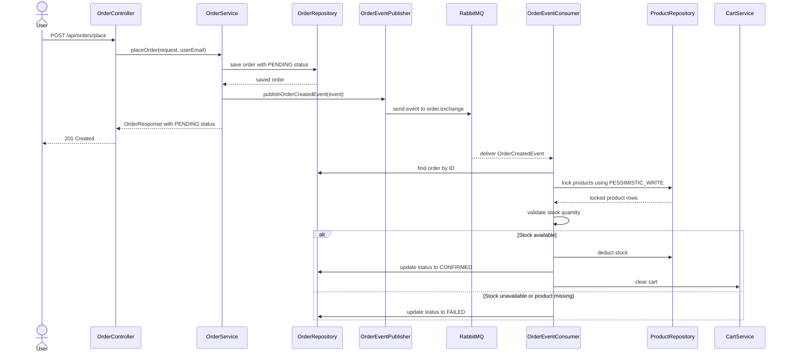

---

## Inventory Consistency and Locking

The system uses pessimistic locking while processing orders to prevent stock race conditions.

### Problem Without Locking

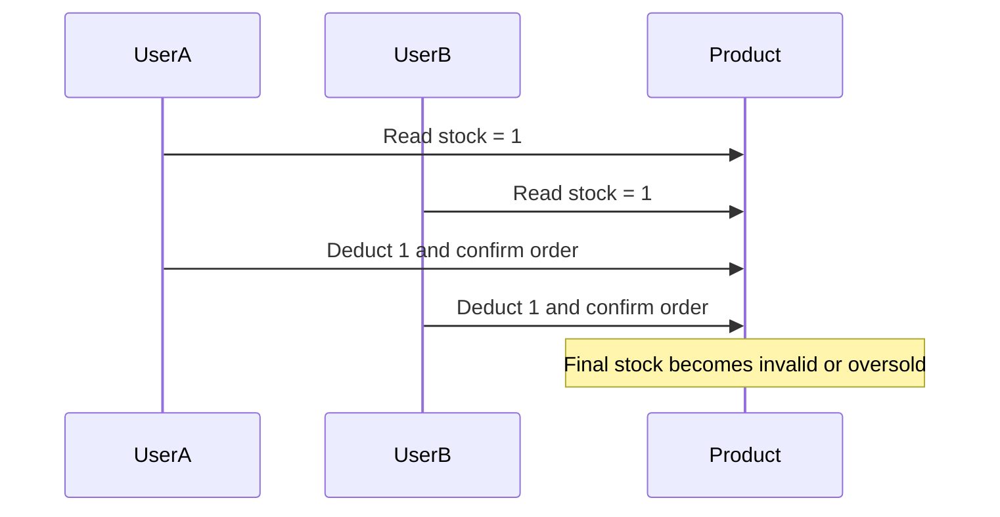

### Solution With Pessimistic Write Lock

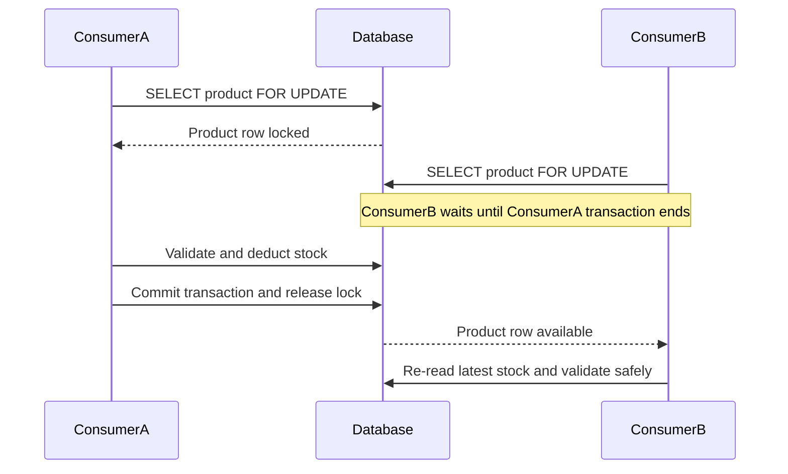

### Lock Implementation

```java
@Lock(LockModeType.PESSIMISTIC_WRITE)
@Query("SELECT p FROM Product p WHERE p.id = :id")
Optional<Product> findByIdForUpdate(@Param("id") Long id);
```

The consumer also sorts order items by `productId` before acquiring locks. This reduces deadlock risk when multiple orders contain the same products in different order combinations.

---

## API Reference

### Authentication APIs

<details>
<summary><code>POST</code> <code><b>/api/auth/register</b></code> - Register user</summary>

Creates a new user account and returns a JWT token.

**Access:** Public

**Request Body**

```json
{
  "name": "Auditee Chowdhury",
  "email": "auditee@example.com",
  "password": "securePass123",
  "role": "USER"
}
```

**Validation Rules**

| Field | Rule |
|---|---|
| `name` | Required |
| `email` | Required and valid email format |
| `password` | Required |
| `role` | Optional. Defaults to `USER` when not supplied |

**Success Response: `201 Created`**

```json
{
  "token": "eyJhbGciOiJIUzI1NiJ9...",
  "tokenType": "Bearer",
  "userId": 1,
  "name": "Auditee Chowdhury",
  "email": "auditee@example.com",
  "role": "USER"
}
```

</details>

<details>
<summary><code>POST</code> <code><b>/api/auth/login</b></code> - Login user</summary>

Authenticates a user and returns a JWT token.

**Access:** Public

**Request Body**

```json
{
  "email": "auditee@example.com",
  "password": "securePass123"
}
```

**Success Response: `200 OK`**

```json
{
  "token": "eyJhbGciOiJIUzI1NiJ9...",
  "tokenType": "Bearer",
  "userId": 1,
  "name": "Auditee Chowdhury",
  "email": "auditee@example.com",
  "role": "USER"
}
```

</details>

---

### Product APIs

<details>
<summary><code>GET</code> <code><b>/api/products</b></code> - Get all products</summary>

Returns all products. This endpoint is public and uses Redis caching.

**Access:** Public

**Success Response: `200 OK`**

```json
[
  {
    "id": 1,
    "name": "iPhone 15",
    "description": "Apple iPhone 15 with 128GB storage",
    "price": 79999.00,
    "stockQuantity": 10,
    "category": "Mobile",
    "imageUrl": "https://example.com/iphone15.jpg",
    "createdAt": "2026-05-27T10:00:00",
    "updatedAt": "2026-05-27T10:00:00"
  }
]
```

</details>

<details>
<summary><code>GET</code> <code><b>/api/products/{id}</b></code> - Get product by ID</summary>

Returns a single product by ID. This endpoint is public and uses Redis caching.

**Access:** Public

**Path Parameter**

| Parameter | Type | Description |
|---|---|---|
| `id` | Long | Product ID |

**Success Response:** `200 OK`  
**Failure Response:** `404 Not Found`

</details>

<details>
<summary><code>POST</code> <code><b>/api/products</b></code> - Create product</summary>

Creates a new product. This action is restricted to admin users.

**Access:** Admin only

**Headers**

```http
Authorization: Bearer <ADMIN_TOKEN>
Content-Type: application/json
```

**Request Body**

```json
{
  "name": "MacBook Pro 14",
  "description": "Apple MacBook Pro with M3 chip and 16GB RAM",
  "price": 199999.00,
  "stockQuantity": 5,
  "category": "Laptop",
  "imageUrl": "https://example.com/macbook-pro.jpg"
}
```

**Success Response:** `201 Created`

</details>

<details>
<summary><code>PUT</code> <code><b>/api/products/{id}</b></code> - Update product</summary>

Updates an existing product. This action is restricted to admin users and evicts relevant Redis caches.

**Access:** Admin only

**Success Response:** `200 OK`  
**Failure Response:** `404 Not Found`

</details>

<details>
<summary><code>DELETE</code> <code><b>/api/products/{id}</b></code> - Delete product</summary>

Deletes a product by ID. This action is restricted to admin users and evicts relevant Redis caches.

**Access:** Admin only

**Success Response:** `204 No Content`  
**Failure Response:** `404 Not Found`

</details>

---

### Cart APIs

All cart endpoints require a valid JWT token.

<details>
<summary><code>GET</code> <code><b>/api/cart</b></code> - View authenticated user's cart</summary>

**Access:** Authenticated user

**Success Response: `200 OK`**

```json
{
  "cartId": 1,
  "userId": 2,
  "items": [
    {
      "cartItemId": 10,
      "productId": 1,
      "productName": "iPhone 15",
      "productImageUrl": "https://example.com/iphone15.jpg",
      "price": 79999.00,
      "quantity": 2,
      "subtotal": 159998.00
    }
  ],
  "totalAmount": 159998.00,
  "totalItems": 2
}
```

</details>

<details>
<summary><code>POST</code> <code><b>/api/cart/add</b></code> - Add product to cart</summary>

Adds a product to the logged-in user's cart. If the product already exists in the cart, the item quantity is increased.

**Access:** Authenticated user

**Request Body**

```json
{
  "productId": 1,
  "quantity": 2
}
```

**Success Response:** `200 OK`

</details>

<details>
<summary><code>PUT</code> <code><b>/api/cart/item/{cartItemId}</b></code> - Update cart item quantity</summary>

Updates the quantity of a specific cart item.

**Access:** Authenticated user

**Request Body**

```json
{
  "quantity": 5
}
```

**Success Response:** `200 OK`

</details>

<details>
<summary><code>DELETE</code> <code><b>/api/cart/item/{cartItemId}</b></code> - Remove cart item</summary>

Removes one item from the authenticated user's cart.

**Access:** Authenticated user

**Success Response:** `200 OK`

</details>

<details>
<summary><code>DELETE</code> <code><b>/api/cart/clear</b></code> - Clear cart</summary>

Clears all items from the authenticated user's cart.

**Access:** Authenticated user

**Success Response:** `200 OK`

</details>

---

### Order APIs

All order endpoints require a valid JWT token.

<details>
<summary><code>POST</code> <code><b>/api/orders/place</b></code> - Place order</summary>

Creates an order from the current user's cart and publishes an order-created event to RabbitMQ. The initial status is `PENDING`.

**Access:** Authenticated user

**Request Body**

```json
{
  "shippingAddress": "42 MG Road, Bangalore, Karnataka - 560001",
  "phoneNumber": "9876543210"
}
```

**Success Response: `201 Created`**

```json
{
  "orderId": 1,
  "userId": 2,
  "items": [
    {
      "orderItemId": 1,
      "productId": 1,
      "productName": "iPhone 15",
      "productImageUrl": "https://example.com/iphone15.jpg",
      "price": 79999.00,
      "quantity": 2,
      "subtotal": 159998.00
    }
  ],
  "totalAmount": 159998.00,
  "status": "PENDING",
  "shippingAddress": "42 MG Road, Bangalore, Karnataka - 560001",
  "phoneNumber": "9876543210",
  "orderDate": "2026-05-27T10:30:00"
}
```

**Important:** `PENDING` does not mean the order is fully confirmed. RabbitMQ processing later changes the order status to `CONFIRMED` or `FAILED`.

</details>

<details>
<summary><code>GET</code> <code><b>/api/orders/my-orders</b></code> - Get authenticated user's orders</summary>

Returns all orders for the logged-in user, sorted by latest order date.

**Access:** Authenticated user

**Success Response:** `200 OK`

</details>

<details>
<summary><code>GET</code> <code><b>/api/orders/{orderId}</b></code> - Get order by ID</summary>

Returns a specific order belonging to the authenticated user.

**Access:** Authenticated user

**Authorization Boundary:** Users can only access their own orders.

**Success Response:** `200 OK`  
**Failure Response:** `404 Not Found`

</details>

---

## Request Lifecycle

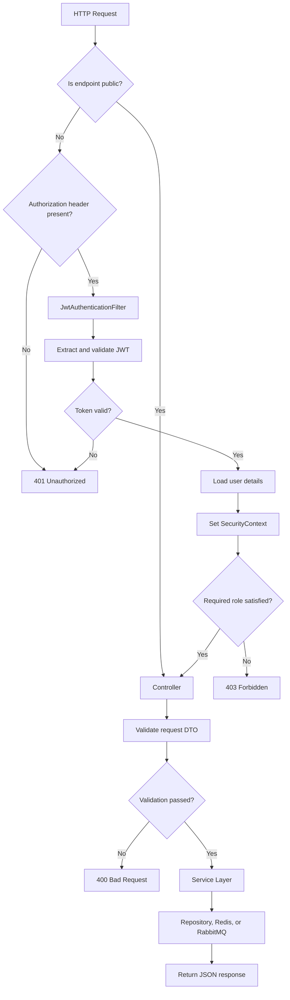

---

## Error Handling

The project uses `GlobalExceptionHandler` to centralize error responses.

### Standard Error Format

```json
{
  "status": 404,
  "message": "Product not found with id: 99",
  "timestamp": "2026-05-27T10:30:00.123"
}
```

### Validation Error Format

```json
{
  "status": 400,
  "message": "Validation failed",
  "errors": {
    "name": "Product name is required",
    "price": "Price must be greater than 0"
  },
  "timestamp": "2026-05-27T10:31:00.456"
}
```

### Exception Mapping

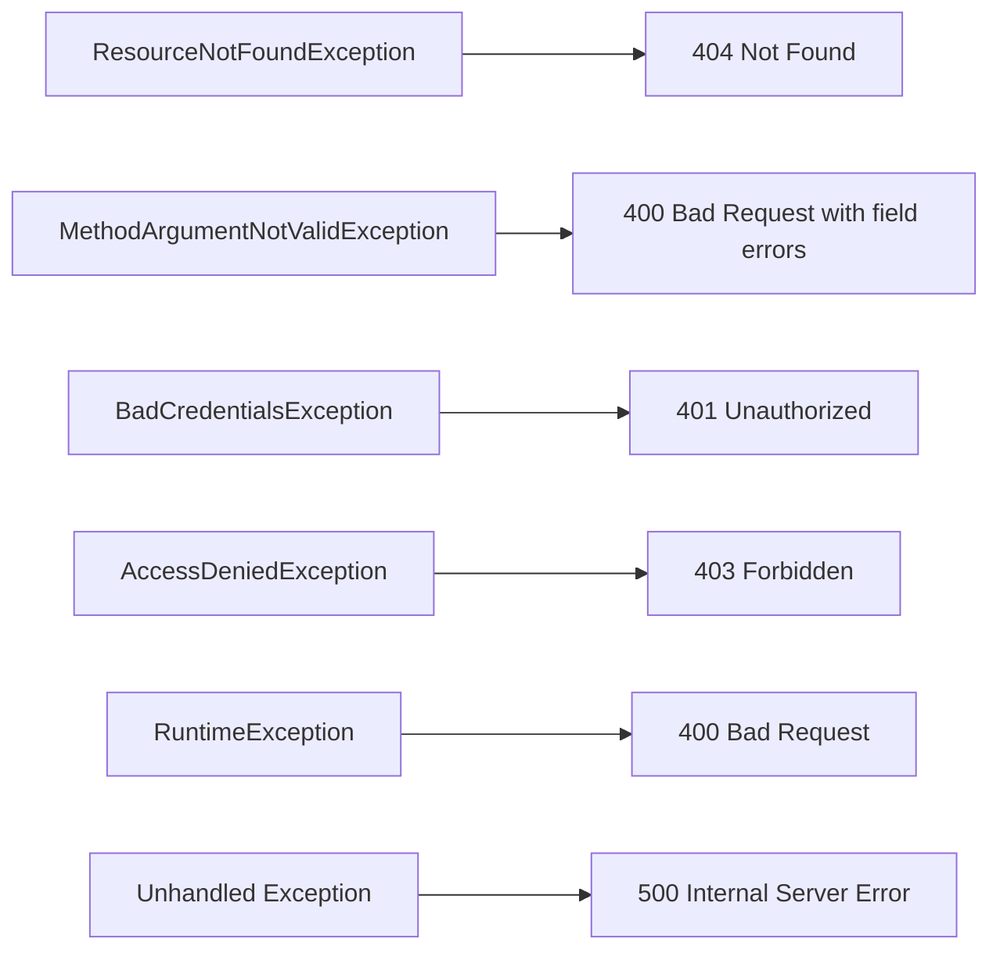

---

## Getting Started

### Prerequisites

| Tool | Minimum Version | Check Command |
|---|---:|---|
| Java JDK | 17 | `java -version` |
| Maven | 3.8+ | `mvn -version` |
| MySQL | 8.x | `mysql --version` |
| Redis | 6.x or newer | `redis-server --version` |
| RabbitMQ | 3.x or newer | `rabbitmqctl status` |
| Git | Any recent version | `git --version` |

### Step 1: Clone the Repository

```bash
git clone https://github.com/your-username/E-commerce-platform-using-springboot.git
cd E-commerce-platform-using-springboot-main
```

### Step 2: Create MySQL Database

```sql
CREATE DATABASE ecommerce_db CHARACTER SET utf8mb4 COLLATE utf8mb4_unicode_ci;
```

### Step 3: Configure Application Properties

Open `src/main/resources/application.properties` and update the database credentials and JWT secret.

```properties
spring.datasource.url=jdbc:mysql://localhost:3306/ecommerce_db
spring.datasource.username=YOUR_MYSQL_USERNAME
spring.datasource.password=YOUR_MYSQL_PASSWORD

app.jwt.secret=YOUR_JWT_SECRET_KEY
app.jwt.expiration=86400000
```

### Step 4: Start Redis

```bash
redis-server
```

Verify Redis:

```bash
redis-cli ping
```

Expected output:

```text
PONG
```

### Step 5: Start RabbitMQ

If RabbitMQ is installed locally:

```bash
rabbitmq-server
```

RabbitMQ management console is usually available at:

```text
http://localhost:15672
```

Default credentials:

```text
username: guest
password: guest
```

### Step 6: Build the Application

```bash
mvn clean install
```

To skip tests during local setup:

```bash
mvn clean install -DskipTests
```

### Step 7: Run the Application

```bash
mvn spring-boot:run
```

Application base URL:

```text
http://localhost:8080
```

### Step 8: Verify API Availability

```bash
curl http://localhost:8080/api/products
```

Expected response on a fresh database:

```json
[]
```

---

## Configuration Reference

| Property | Example Value | Description |
|---|---|---|
| `spring.application.name` | `ecommerce-springboot` | Application name |
| `server.port` | `8080` | Embedded server port |
| `spring.datasource.url` | `jdbc:mysql://localhost:3306/ecommerce_db` | MySQL connection URL |
| `spring.datasource.username` | `root` | MySQL username |
| `spring.datasource.password` | `password` | MySQL password |
| `spring.jpa.hibernate.ddl-auto` | `update` | Auto-updates schema in development |
| `spring.jpa.show-sql` | `true` | Prints SQL queries in console |
| `spring.jpa.properties.hibernate.format_sql` | `true` | Formats SQL output |
| `app.jwt.secret` | `YOUR_JWT_SECRET_KEY` | JWT signing secret |
| `app.jwt.expiration` | `86400000` | JWT expiry in milliseconds |
| `spring.data.redis.host` | `localhost` | Redis host |
| `spring.data.redis.port` | `6379` | Redis port |
| `spring.cache.redis.time-to-live` | `600000` | Redis cache TTL |
| `spring.rabbitmq.host` | `localhost` | RabbitMQ host |
| `spring.rabbitmq.port` | `5672` | RabbitMQ AMQP port |
| `spring.rabbitmq.username` | `guest` | RabbitMQ username |
| `spring.rabbitmq.password` | `guest` | RabbitMQ password |
| `order.exchange` | `order.exchange` | RabbitMQ exchange name |
| `order.queue` | `order.queue` | RabbitMQ queue name |
| `order.routing-key` | `order.created` | RabbitMQ routing key |

---

## Local Development with Docker

If Redis and RabbitMQ are not installed locally, they can be started using Docker.

### Redis Container

```bash
docker run --name ecommerce-redis -p 6379:6379 -d redis:7
```

### RabbitMQ Container with Management Console

```bash
docker run --name ecommerce-rabbitmq \
  -p 5672:5672 \
  -p 15672:15672 \
  -d rabbitmq:3-management
```

### MySQL Container

```bash
docker run --name ecommerce-mysql \
  -e MYSQL_ROOT_PASSWORD=root \
  -e MYSQL_DATABASE=ecommerce_db \
  -p 3306:3306 \
  -d mysql:8.0
```

Update `application.properties` accordingly:

```properties
spring.datasource.username=root
spring.datasource.password=root
```

---

## Testing Guide

### Run All Tests

```bash
mvn test
```

### Run Application Smoke Test

```bash
mvn test -Dtest=EcommerceApplicationTests
```

### Manual Functional Test Areas

| Area | What to Validate |
|---|---|
| Auth | Register, login, invalid credentials, duplicate email |
| Security | Public product APIs, protected cart/order APIs, admin-only product writes |
| Products | Create, list, fetch by ID, update, delete |
| Cache | Verify product reads are cached and cache is evicted after writes |
| Cart | Add item, update quantity, remove item, clear cart |
| Orders | Place order, verify status starts as `PENDING` |
| RabbitMQ | Verify event is published to queue and consumed |
| Inventory | Verify stock decreases only after successful async processing |
| Failure Scenario | Place order with insufficient stock and verify status becomes `FAILED` |

---

## Postman Execution Flow

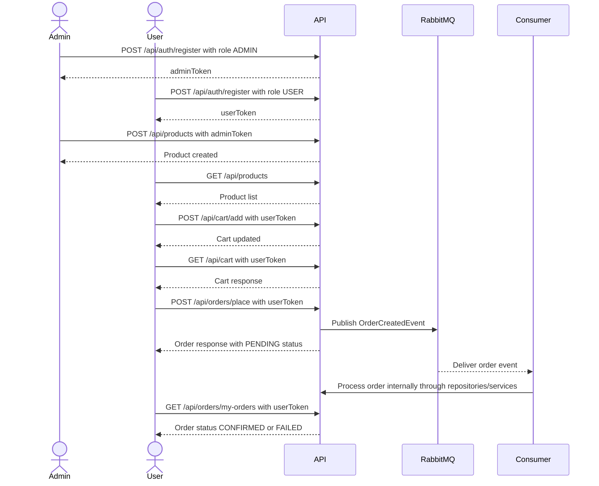

### Recommended Postman Variables

| Variable | Example |
|---|---|
| `baseUrl` | `http://localhost:8080` |
| `adminToken` | JWT token returned by admin login |
| `userToken` | JWT token returned by user login |
| `productId` | Product ID returned after create product |
| `cartItemId` | Cart item ID returned after add to cart |
| `orderId` | Order ID returned after place order |

---

## Production Readiness Checklist

| Area | Current Development Setup | Production Recommendation |
|---|---|---|
| JWT Secret | Stored in `application.properties` | Move to environment variable or secret manager |
| DB Credentials | Stored in properties file | Use environment variables or vault |
| Schema Management | `ddl-auto=update` | Use Flyway or Liquibase migrations |
| SQL Logging | `show-sql=true` | Disable in production |
| HTTPS | Not configured in application | Terminate TLS at API gateway/load balancer |
| Admin Registration | API accepts role in request | Restrict admin creation to internal process |
| Redis | Localhost config | Use managed Redis or secured Redis cluster |
| RabbitMQ | Local default credentials | Use secured credentials, durable queues, DLQ, retry policy |
| Observability | Console logs | Add structured logging, metrics, tracing |
| API Documentation | README only | Add OpenAPI/Swagger integration |
| Rate Limiting | Not implemented | Add API gateway or Bucket4j |
| CORS | Not explicitly configured | Configure allowed frontend origins |

> [!WARNING]
> Never commit real database passwords, JWT secrets, or production credentials into version control.

---

## Known Constraints

| Constraint | Explanation |
|---|---|
| Payment gateway not implemented | Current flow creates orders but does not process online payments |
| No refresh token flow | JWT access token is used directly with configured expiry |
| No shipping lifecycle | Order statuses support confirmation/failure but not shipment tracking |
| No admin order dashboard | Admin product operations exist, but order management APIs are limited |
| No email notification | Order creation and confirmation do not currently trigger emails |
| No OpenAPI UI | API documentation is maintained in README, not Swagger UI |

---

## Future Enhancements

| Feature | Priority | Description |
|---|---:|---|
| Payment gateway integration | High | Integrate Razorpay, Stripe, or PayPal payment flow |
| Swagger/OpenAPI | High | Generate interactive API documentation |
| Docker Compose | High | Run MySQL, Redis, RabbitMQ, and Spring Boot together |
| Dead Letter Queue | High | Add failed message queue for RabbitMQ processing failures |
| Retry policy | High | Retry transient failures during async order processing |
| Refresh tokens | Medium | Add secure access-token renewal |
| Admin order management | Medium | Allow admin to view and update order lifecycle |
| Product search and filtering | Medium | Add search by category/name using repository methods |
| Email notifications | Medium | Notify users after order confirmation or failure |
| CI/CD pipeline | Medium | Add GitHub Actions build and test workflow |
| Monitoring | Medium | Add Actuator, Prometheus, and Grafana integration |

---

## Contributing

### Branching Workflow

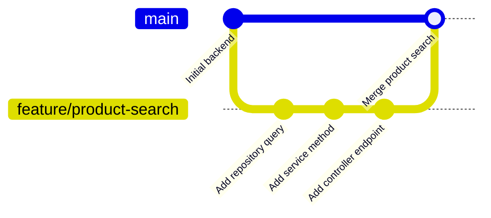

### Contribution Steps

1. Fork the repository.
2. Create a new feature branch.
3. Implement the change with clean commits.
4. Add or update tests where required.
5. Update documentation if behavior changes.
6. Open a pull request into the `main` branch.

### Commit Message Convention

```text
feat: add new feature
fix: resolve bug
docs: update documentation
refactor: improve code structure without behavior change
test: add or update tests
chore: update build, dependencies, or tooling
```

---

## License

This project is licensed under the MIT License. See the `LICENSE` file for details.

```text
MIT License

Permission is hereby granted, free of charge, to any person obtaining a copy
of this software and associated documentation files to deal in the Software
without restriction, including without limitation the rights to use, copy,
modify, merge, publish, distribute, sublicense, and/or sell copies of the
Software, subject to the conditions of the MIT License.
```

---

<div align="center">

**Built with Spring Boot, MySQL, Redis, RabbitMQ, Spring Security, and JWT**

[](https://openjdk.org/)
[](https://spring.io/projects/spring-boot)
[](https://www.mysql.com/)
[](https://redis.io/)
[](https://www.rabbitmq.com/)

</div>
